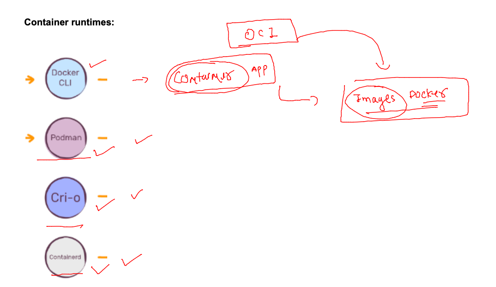
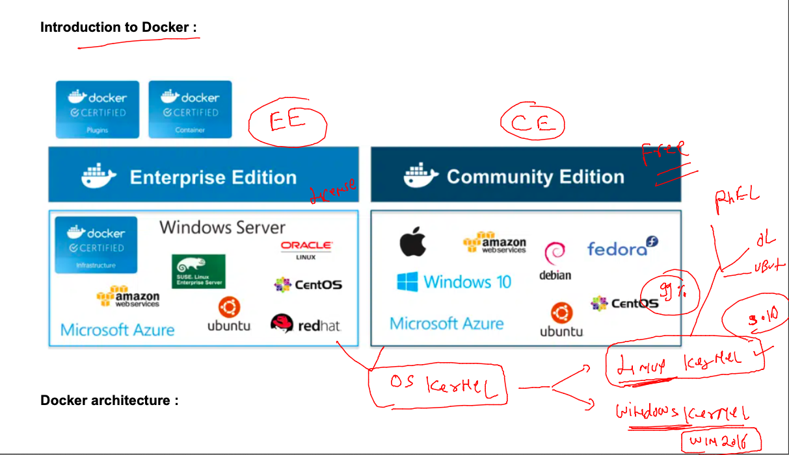

### getting started 

### vm vs container 


### Introduction to CRE -- 


### OCI for CRE 



### docker support with windows and linux kernel 



### installing docker ce on amazon linux in aws cloud 

### in cloud linux vm -- aws / azure / oracle cloud 

```
[root@ip-172-31-87-240 ~]# yum install docker 
Failed to set locale, defaulting to C
Loaded plugins: extras_suggestions, langpacks, priorities, update-motd
Resolving Dependencies
--> Running transaction check
---> Package docker.x86_64 0:20.10.17-1.amzn2.0.1 will be installed
--> Processing Dependency: runc >= 1.0.0 for package: docker-20.10.17-1.amzn2.0.1.x86_64
--> Processing Dependency: libcgroup >= 0.40.rc1-5.15 for package: docker-20.10.17-1.amzn2.0.1.x86_64
--> Processing Dependency: containerd >= 1.3.2 for package: docker-20.10.17-1.amzn2.0.1.x86_64
--> Processing Dependency: pigz for package: docker-20.10.17-1.amzn2.0.1.x86_64
--> Running transaction check
---> Package containerd.x86_64 0:1.6.8-1.amzn2 will be installed
---> Package libcgroup.x86_64 0:0.41-21.amzn2 will be installed
---> Package pigz.x86_64 0:2.3.4-1.amzn2.0.1 will be installed
---> Package runc.x86_64 0:1.1.4-1.amzn2 will be installed
--> Finished Dependency Resolution

Dependencies Resolved

==========================================================================================================================
 Package                  Arch                 Version                              Repository                       Size
==========================================================================================================================
Installing:
 docker                   x86_64               20.10.17-1.amzn2.0.1                 amzn2extra-docker                39 M
Installing for dependencies:
 containerd               x86_64               1.6.8-1.amzn2                        amzn2extra-docker                27 M
 libcgroup                x86_64               0.41-21.amzn2                        amzn2-core                       66 k
 pigz                     x86_64               2.3.4-1.amzn2.0.1                    amzn2-core                       81 k
 runc                     x86_64               1.1.4-1.amzn2                        amzn2extra-docker               2.9 M

Transaction Summary
==========================================================================================================================
Install  1 Package (+4 Dependent packages)

Total download size: 69 M
Installed size: 260 M
Is this ok [y/d/N]: y
Downloading packages:
```

### NOn cloud based linux vms 

[use_link](https://docs.docker.com/engine/install/rhel/)


### lets understand docker configurations 

```
[root@ip-172-31-87-240 ~]# rpm  -qc  docker 
/etc/sysconfig/docker
/etc/sysconfig/docker-storage

```

### start docker runtime engine 

```
[root@ip-172-31-87-240 ~]# systemctl start docker 
[root@ip-172-31-87-240 ~]# systemctl enable docker 
Created symlink from /etc/systemd/system/multi-user.target.wants/docker.service to /usr/lib/systemd/system/docker.service.
[root@ip-172-31-87-240 ~]# systemctl status  docker 
● docker.service - Docker Application Container Engine
   Loaded: loaded (/usr/lib/systemd/system/docker.service; enabled; vendor preset: disabled)
   Active: active (running) since Mon 2023-01-02 05:21:39 UTC; 12s ago
     Docs: https://docs.docker.com
 Main PID: 3656 (dockerd)
   CGroup: /system.slice/docker.service
           └─3656 /usr/bin/dockerd -H fd:// --containerd=/run/containerd/containerd.sock --default-ulimit nofile=32768:...

Jan 02 05:21:38 ip-172-31-87-240.ec2.internal dockerd[3656]: time="2023-01-02T05:21:38.890374920Z" level=info msg="...grpc
Jan 02 05:21:38 ip-172-31-87-
```

### docker architecture and docker clients


### connecting users for docker client access 

```
fire@ashutoshhs-MacBook-Air ~ % ssh  ashu@54.81.195.110 
The authenticity of host '54.81.195.110 (54.81.195.110)' can't be established.
ECDSA key fingerprint is SHA256:eqoycsooTY58A3BlOqavLW5+lHG1pK5ZWsWKc6DH0Is.
Are you sure you want to continue connecting (yes/no/[fingerprint])? yes
Warning: Permanently added '54.81.195.110' (ECDSA) to the list of known hosts.
ashu@54.81.195.110's password: 

       __|  __|_  )
       _|  (     /   Amazon Linux 2 AMI
      ___|\___|___|

https://aws.amazon.com/amazon-linux-2/
-bash: warning: setlocale: LC_CTYPE: cannot change locale (UTF-8): No such file or directory
[ashu@ip-172-31-87-240 ~]$ 
```

### checking docker version 

```
[ashu@ip-172-31-87-240 ~]$ 
[ashu@ip-172-31-87-240 ~]$ docker  version 
Client:
 Version:           20.10.17
 API version:       1.41
 Go version:        go1.18.6
 Git commit:        100c701
 Built:             Wed Sep 28 23:10:17 2022
 OS/Arch:           linux/amd64
 Context:           default
 Experimental:      true

Server:
 Engine:
  Version:          20.10.17
  API version:      1.41 (minimum version 1.12)
  Go version:       go1.18.6
  Git commit:       a89b842
  Built:            Wed Sep 28 23:10:55 2022
  OS/Arch:          linux/amd64
  Experimental:     false
 containerd:
  Version:          1.6.8
  GitCommit:        9cd3357b7fd7218e4aec3eae239db1f68a5a6ec6
 runc:
  Version:          1.1.4
  GitCommit:        5fd4c4d144137e991c4acebb2146ab1483a97925
 docker-init:
  Version:          0.19.0
  GitCommit:        de40ad0


```

## some docker operations 

### pulling image from docker hub 

```
[ashu@ip-172-31-87-240 ~]$ docker  images
REPOSITORY   TAG       IMAGE ID   CREATED   SIZE
[ashu@ip-172-31-87-240 ~]$ docker  pull oraclelinux:8.4 
8.4: Pulling from library/oraclelinux
a4df6f21af84: Pull complete 
Digest: sha256:b81d5b0638bb67030b207d28586d0e714a811cc612396dbe3410db406998b3ad
Status: Downloaded newer image for oraclelinux:8.4
docker.io/library/oraclelinux:8.4
[ashu@ip-172-31-87-240 ~]$ 
[ashu@ip-172-31-87-240 ~]$ docker  images
REPOSITORY    TAG       IMAGE ID       CREATED         SIZE
oraclelinux   8.4       97e22ab49eea   14 months ago   246MB
[ashu@ip-172-31-87-240 ~]$ 


```

### docker storage database 


### exloring ddocker db 

```
[ashu@ip-172-31-87-240 ~]$ docker  info   |   grep -i root
 Docker Root Dir: /var/lib/docker
```

### checking by root user 

```
[root@ip-172-31-87-240 ~]# whoami
root
[root@ip-172-31-87-240 ~]# cd  /var/lib/docker 
[root@ip-172-31-87-240 docker]# ls
buildkit  containers  image  network  overlay2  plugins  runtimes  swarm  tmp  trust  volumes
[root@ip-172-31-87-240 docker]# cd  image/
[root@ip-172-31-87-240 image]# ls
overlay2
[root@ip-172-31-87-240 image]# cd overlay2/
[root@ip-172-31-87-240 overlay2]# ls
distribution  imagedb  layerdb  repositories.json
[root@ip-172-31-87-240 overlay2]# cd imagedb/
[root@ip-172-31-87-240 imagedb]# ls
content  metadata
[root@ip-172-31-87-240 imagedb]# cd content/
[root@ip-172-31-87-240 content]# ls
sha256
[root@ip-172-31-87-240 content]# cd sha256/
[root@ip-172-31-87-240 sha256]# ls
97e22ab49eea70a5d500e00980537605d56f30f9614b3a6d6c4ae9ddbd642489
[root@ip-172-31-87-240 sha256]# 


```


### pulling image without any tag 

```
[ashu@ip-172-31-87-240 lib]$ docker pull mysql
Using default tag: latest
latest: Pulling from library/mysql
0ed027b72ddc: Pull complete 
0296159747f1: Pull complete 
3d2f9b664bd3: Pull complete 
df6519f81c26: Pull complete 
36bb5e56d458: Pull complete 
054e8fde88d0: Pull complete 
f2b494c50c7f: Pull complete 
132bc0d471b8: Pull complete 
135ec7033a05: Pull complete 
5961f0272472: Pull complete 
75b5f7a3d3a4: Pull complete 
Digest: sha256:3d7ae561cf6095f6aca8eb7830e1d14734227b1fb4748092f2be2cfbccf7d614
Status: Downloaded newer image for mysql:latest
docker.io/library/mysql:latest
[ashu@ip-172-31-87-240 lib]$ docker  images
REPOSITORY    TAG       IMAGE ID       CREATED         SIZE
mysql         latest    7484689f290f   3 weeks ago     538MB
mysql         5.6       dd3b2a5dcb48   12 months ago   303MB
oraclelinux   8.4       97e22ab49eea   14 months ago   246MB
[ashu@ip-172-31-87-240 lib]$ 
```

### task 1 

### creating first container 

```
[ashu@ip-172-31-87-240 ~]$ docker run  -it -d  --name ashuc1  oraclelinux:8.4  bash 
5c2487a940c42fd2d0cca5caad056e4e30769fda94cb526ce6001c4ff57538e7
[ashu@ip-172-31-87-240 ~]$ docker  ps
CONTAINER ID   IMAGE             COMMAND              CREATED         STATUS         PORTS                                   NAMES
5c2487a940c4   oraclelinux:8.4   "bash"               3 seconds ago   Up 2 seconds                                           ashuc1
```

### access running container using exec 

```
[ashu@ip-172-31-87-240 ~]$ docker  exec  -it  ashuc1  bash 
[root@5c2487a940c4 /]# 
[root@5c2487a940c4 /]# pwd
/
[root@5c2487a940c4 /]# echo  "hello oracle guys "  >helloc1.txt 
[root@5c2487a940c4 /]# ls
bin  boot  dev  etc  helloc1.txt  home  lib  lib64  media  mnt  opt  proc  root  run  sbin  srv  sys  tmp  usr  var
[root@5c2487a940c4 /]# exit
exit

```

### copy data from container to host then host to container 

```
[ashu@ip-172-31-87-240 ~]$ whoami
ashu
[ashu@ip-172-31-87-240 ~]$ pwd
/home/ashu
[ashu@ip-172-31-87-240 ~]$ ls
[ashu@ip-172-31-87-240 ~]$ docker  ps
CONTAINER ID   IMAGE             COMMAND                  CREATED          STATUS          PORTS                                   NAMES
2c92657962aa   oraclelinux:8.4   "bash"                   6 minutes ago    Up 5 minutes                                            anandc2
3b3c3afab46e   mysql             "docker-entrypoint.s…"   8 minutes ago    Up 8 minutes    3306/tcp, 33060/tcp                     ankita1c2
d1277f19b5c9   saurabhc1         "bash"                   8 minutes ago    Up 8 minutes                                            saurabhc2
efc17d226056   mysql             "docker-entrypoint.s…"   8 minutes ago    Up 8 minutes    3306/tcp, 33060/tcp                     ankita1c1
b12f21286746   saurabhc1         "bash"                   8 minutes ago    Up 8 minutes                                            saurabhc1
2e517a23de20   oraclelinux:8.4   "bash"                   9 minutes ago    Up 9 minutes                                            sivac2
1312436fdaf0   oraclelinux:8.4   "bash"                   9 minutes ago    Up 9 minutes                                            sivac1
4c045ad94c52   oraclelinux:8.4   "bash"                   9 minutes ago    Up 9 minutes                                            ashuc2
1a613034ce92   busybox           "/bin/sh"                10 minutes ago   Up 9 minutes                                            sibashisc2
5c2487a940c4   oraclelinux:8.4   "bash"                   10 minutes ago   Up 10 minutes                                           ashuc1
fec727b7b406   busybox           "/bin/sh"                10 minutes ago   Up 10 minutes                                           sibashisc1
6b76de733ee3   httpd:2.4         "httpd-foreground"       13 minutes ago   Up 13 minutes   0.0.0.0:8080->80/tcp, :::8080->80/tcp   sudeepc3
974d00ba2046   alpine            "/bin/sh"                18 minutes ago   Up 16 minutes                                           anandC1
0ebafbd37715   busybox           "sh"                     19 minutes ago   Up 6 minutes                                            shaileshc2
c5e014675b09   busybox           "sh"                     20 minutes ago   Up 6 minutes                                            shaileshc1
[ashu@ip-172-31-87-240 ~]$ docker  cp   ashuc1:/helloc1.txt   /home/ashu 
[ashu@ip-172-31-87-240 ~]$ ls
helloc1.txt
[ashu@ip-172-31-87-240 ~]$ docker  cp  helloc1.txt  ashuc2:/  
[ashu@ip-172-31-87-240 ~]$ 
[ashu@ip-172-31-87-240 ~]$ docker  exec -it  ashuc2  ls  /
bin   dev  helloc1.txt	lib    media  opt   root  sbin	sys  usr
boot  etc  home		lib64  mnt    proc  run   srv	tmp  var
[ashu@ip-172-31-87-240 ~]$ 

```

### remove container 

```
[ashu@ip-172-31-87-240 ~]$ docker  rm  ashuc1
Error response from daemon: You cannot remove a running container 5c2487a940c42fd2d0cca5caad056e4e30769fda94cb526ce6001c4ff57538e7. Stop the container before attempting removal or force remove
[ashu@ip-172-31-87-240 ~]$ docker  stop  ashuc1 
ashuc1
[ashu@ip-172-31-87-240 ~]$ docker  rm  ashuc1
ashuc1

```

### removing image 

```
[ashu@ip-172-31-87-240 ~]$ docker rmi  openjdk:8 
Untagged: openjdk:8
Untagged: openjdk@sha256:86e863cc57215cfb181bd319736d0baf625fe8f150577f9eb58bd937f5452cb8
[ashu@ip-172-31-87-240 ~]$ 
```

## app containerization 


### after connecting to vscode we are creating directory structure 

```
[ashu@ip-172-31-87-240 ~]$ pwd
/home/ashu
[ashu@ip-172-31-87-240 ~]$ ls
helloc1.txt
[ashu@ip-172-31-87-240 ~]$ mkdir ashu-apps 
[ashu@ip-172-31-87-240 ~]$ ls
ashu-apps  helloc1.txt
[ashu@ip-172-31-87-240 ~]$ cd  ashu-apps/
[ashu@ip-172-31-87-240 ashu-apps]$ ls
[ashu@ip-172-31-87-240 ashu-apps]$ mkdir  java-apps  node-app  db-apps  
[ashu@ip-172-31-87-240 ashu-apps]$ ls
db-apps  java-apps  node-app
[ashu@ip-172-31-87-240 ashu-apps]$ 
```

## Dockerfiles example 

### java sample code example 

### code 

```
class ashucode { 
    public static void main(String args[]) 
    { 
        // test expression 
        while (true) { 
            System.out.println("Hello World, i am ashutoshh singh ! \n"); 
            try {
                Thread.sleep(2000);
            } catch (Exception ex) {
                // Ignored
            }
  
            // update expression 
        } 
    } 
} 

```

### Dockerfile 

```
FROM openjdk 
# asking docker engine / daemon to pull above image from docker hub 
LABEL name=ashutosh
LABEL email=ashutoshh@linux.com 
# optional field but to share image creator info 
RUN mkdir /mycode 
# to run any command inside image during build time 
COPY ashucode.java /mycode/
WORKDIR /mycode
# changing directory during image build time
RUN javac ashucode.java
#  javac is command for compiling java code 
CMD ["java","ashucode"]
# use of CMD is to set default process for container image 
```

### lets build it 

```
ashu@ip-172-31-87-240 ashu-apps]$ pwd
/home/ashu/ashu-apps
[ashu@ip-172-31-87-240 ashu-apps]$ ls
db-apps  java-apps  node-app
[ashu@ip-172-31-87-240 ashu-apps]$ docker build  -t  ashujavaapp:1.0   java-apps/ 
Sending build context to Docker daemon  3.584kB
Step 1/8 : FROM openjdk
latest: Pulling from library/openjdk
0ed027b72ddc: Already exists 
3502f40d35be: Pull complete 
a27d2c7acde8: Pull complete 
Digest: sha256:fbddf9af4d18110cfbd80e8cd89fd7503c5bd784d6ffb207b53c95f0dcac77a7
Status: Downloaded newer image for openjdk:latest
 ---> be9017b1d8c5
Step 2/8 : LABEL name=ashutosh
 ---> Running in b81cf15393cd
Removing intermediate container b81cf15393cd
 ---> 684ae759647c
Step 3/8 : LABEL email=ashutoshh@linux.com
 ---> Running in 0a7b363c3fd7
Removing intermediate container 0a7b363c3fd7
 ---> 7583e5ac40b0
Step 4/8 : RUN mkdir /mycode
 ---> Running in eac0ce20daad
Removing intermediate container eac0ce20daad
 ---> 0a5b5257a4fb
Step 5/8 : COPY ashucode.java /mycode/
 ---> 1245ad6fe752
Step 6/8 : WORKDIR /mycode
 ---> Running in 46ef11f3cc32
Removing intermediate container 46ef11f3cc32
 ---> b0e3f05e51eb
Step 7/8 : RUN javac ashucode.java
 ---> Running in 439e2b5d0d26
Removing intermediate container 439e2b5d0d26
 ---> 3a694b784144
Step 8/8 : CMD ["java","ashucode"]
 ---> Running in b671f50f121a
Removing intermediate container b671f50f121a
 ---> 1287fa7acb3d
Successfully built 1287fa7acb3d
Successfully tagged ashujavaapp:1.0
```

### verify it 

```
ashu@ip-172-31-87-240 ashu-apps]$ docker images
REPOSITORY        TAG       IMAGE ID       CREATED          SIZE
ankitajavaapp     1.0       59e7c03a5108   15 seconds ago   467MB
sudeephello       1.0       30f60fbc4aac   18 seconds ago   467MB
sibashisjavaapp   1.0       b6b8d780eb4f   20 seconds ago   467MB
ashujavaapp       1.0       1287fa7acb3d   20 seconds ago   467MB
```

### creating container and checking output of java code 

```
[ashu@ip-172-31-87-240 ashu-apps]$ docker run -itd --name  ashujc1   ashujavaapp:1.0  
192fa350d27ee02e4996d2a3595258efbeefae99bc4592e7e7c8aade7f56e6f7
[ashu@ip-172-31-87-240 ashu-apps]$ docker ps
CONTAINER ID   IMAGE             COMMAND            CREATED         STATUS                  PORTS     NAMES
39bea9ea13af   anandcode1.0      "java AnandCode"   1 second ago    Up Less than a second             anandC1
192fa350d27e   ashujavaapp:1.0   "java ashucode"    3 seconds ago   Up 2 seconds                      ashujc1
```


