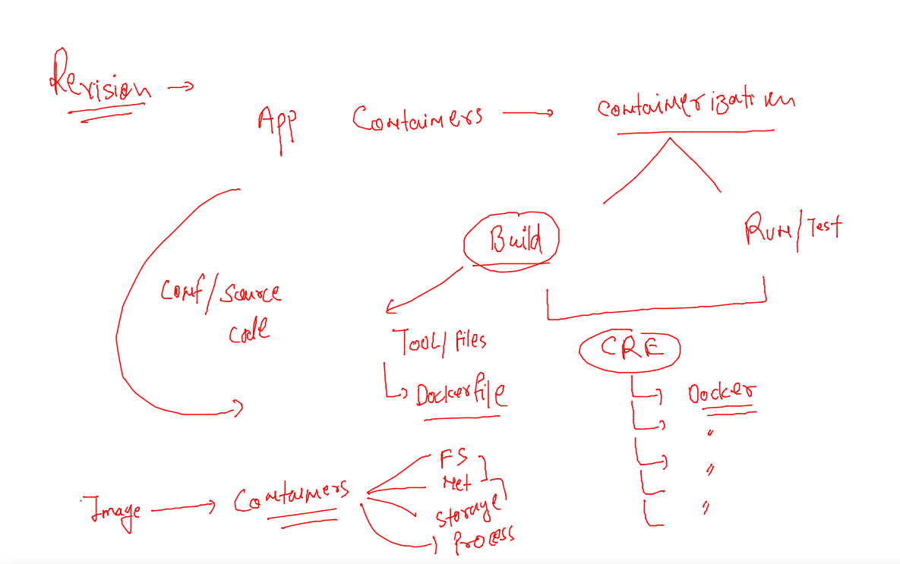
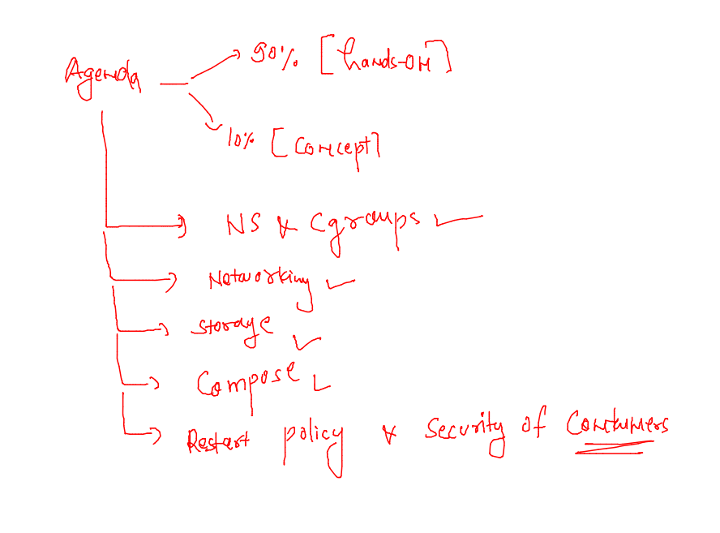
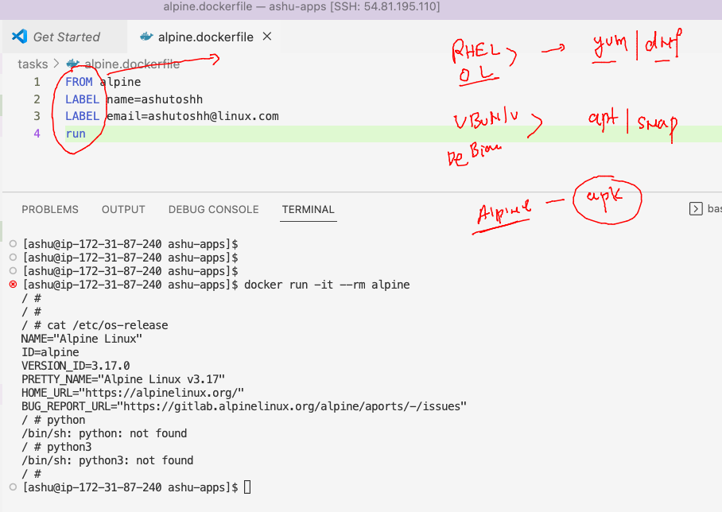
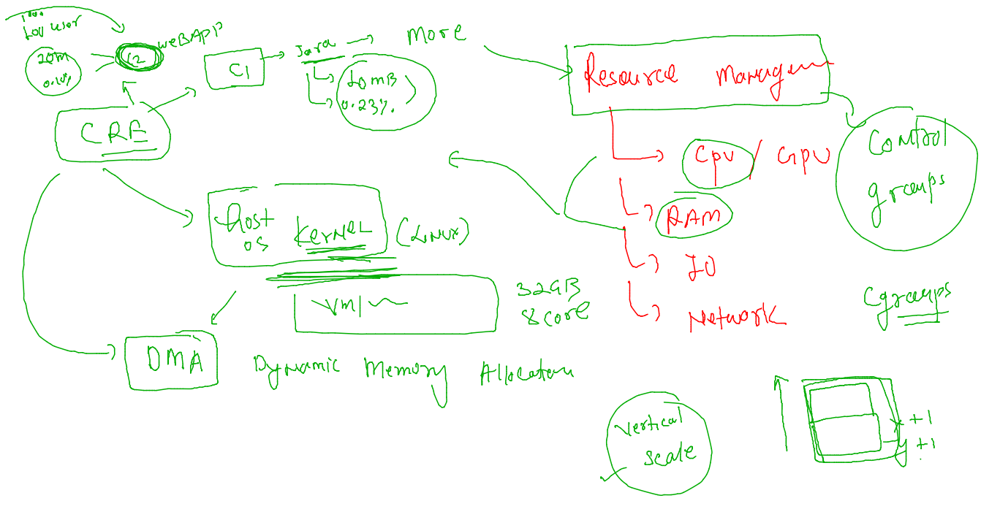
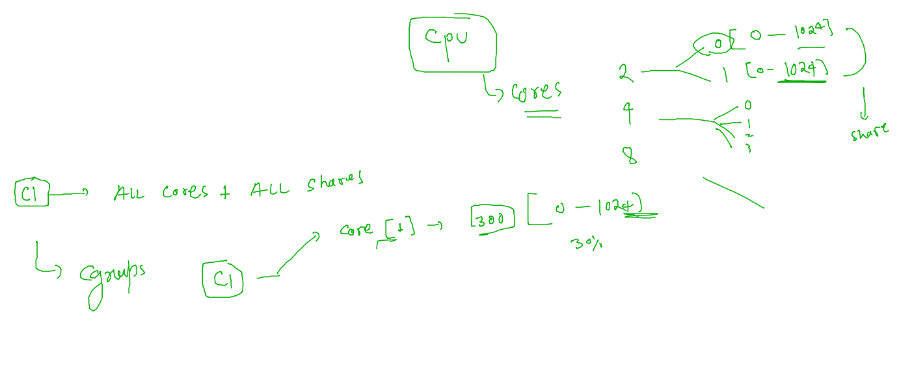
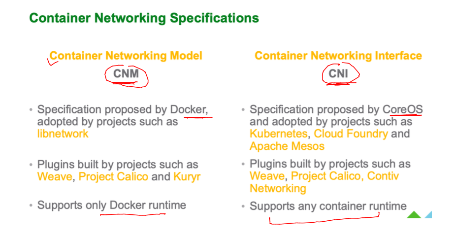
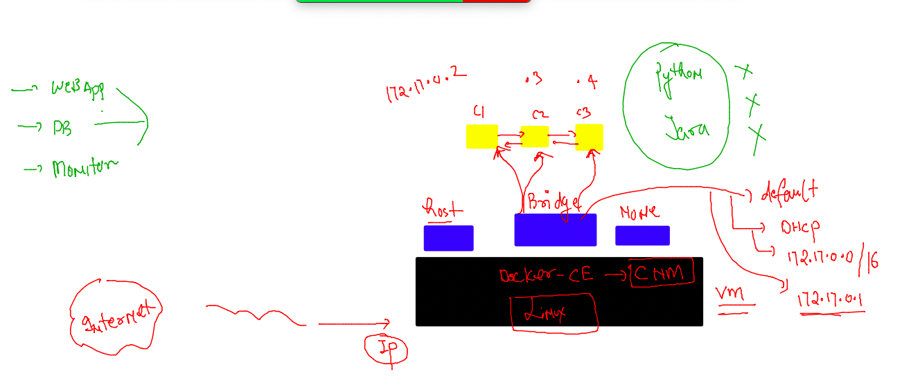
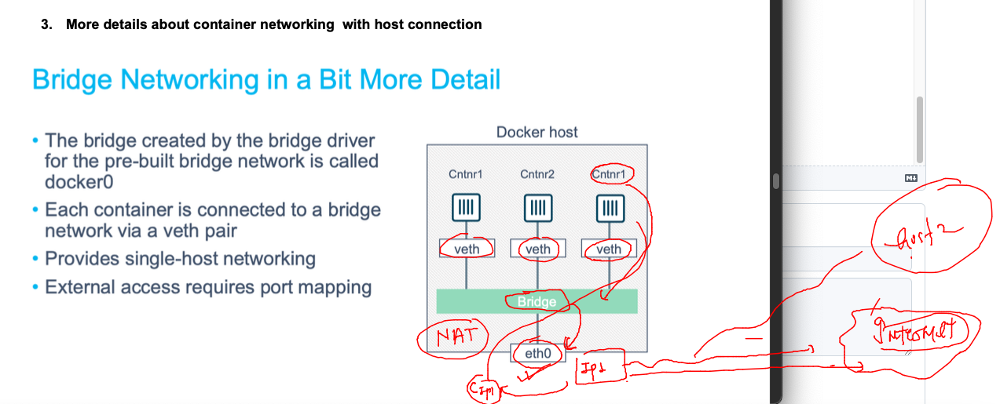
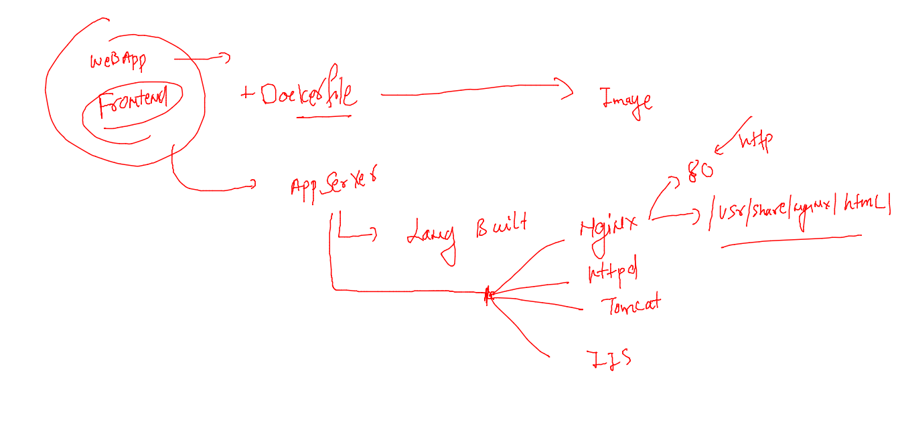
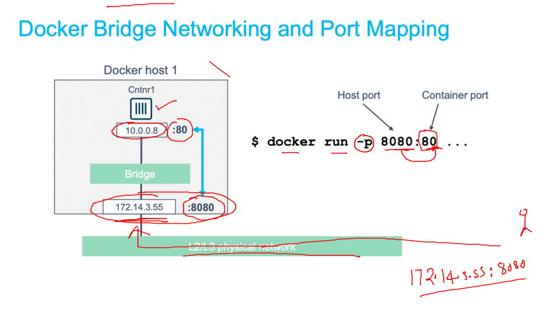

## Revision 



### agenda 



### software installer for diff linux distro 



### using entrypoint and cmd to replace process 

```
[ashu@ip-172-31-87-240 tasks]$ docker run -itd --name t3  --entrypoint sleep  ashualp:pycodev1   100
be690d0e4c9584f6754615a1f41090e6e99e7c1804c8eab39eecd985f642a235
[ashu@ip-172-31-87-240 tasks]$ docker ps
CONTAINER ID   IMAGE              COMMAND                  CREATED              STATUS              PORTS     NAMES
be690d0e4c95   ashualp:pycodev1   "sleep 100"              3 seconds ago        Up 2 seconds                  t3
75f85638e0c2   ashualp:pycodev1   "/bin/sh -c 'python3…"   About a minute ago   Up About a minute             t2
e49f9fbb7b33   ashualp:pycodev1   "/bin/sh -c 'python3…"   About a minute ago   Up About a minute             t1
8c0495c60e65   alpine             "/bin/sh"                11 minutes ago       Up 11 minutes                 test1
[ashu@ip-172-31-87-240 tasks]$ 

```

## Understanding Cgroups 



### creating container with no memory boundry 

```
[ashu@ip-172-31-87-240 tasks]$ docker run -itd --name ashuc1 alpine sleep 1000 
44453d8e2e18961b8bd0ef63a0295b9e353d2b3a02cce0f1f35b06b2a6b7955e
[ashu@ip-172-31-87-240 tasks]$ docker ps
CONTAINER ID   IMAGE     COMMAND        CREATED         STATUS         PORTS     NAMES
44453d8e2e18   alpine    "sleep 1000"   3 seconds ago   Up 2 seconds             ashuc1
[ashu@ip-172-31-87-240 tasks]$ 
```

### with RAM limit 

```
[ashu@ip-172-31-87-240 tasks]$ docker run -itd --name ashuc2 --memory 200M  alpine sleep 1000 
5e2b95b317d9164675a86e46c7d23f4359963153b189a3b194ce6dc85532b5c0
[ashu@ip-172-31-87-240 tasks]$ 
```

### CPU 




```
[ashu@ip-172-31-87-240 tasks]$ docker run -itd --name ashuc2 --memory 200M   --cpuset-cpus=0 --cpu-shares=300     alpine sleep 1000 
f68589ea8163396736bdc94492fc35c66e85b3f825fa55db32bb0a39bf5f7373
[ashu@ip-172-31-87-240 tasks]$ docker ps
CONTAINER ID   IMAGE     COMMAND        CREATED         STATUS         PORTS     NAMES
f68589ea8163   alpine    "sleep 1000"   4 seconds ago   Up 3 seconds             ashuc2
[ashu@ip-172-31-87-240 tasks]$ 

```

## Networking in containers 

### there are two networking models for containers 



### CNM bridges 



### listing bridges 

```
[ashu@ip-172-31-87-240 tasks]$ docker  network  ls
NETWORK ID     NAME      DRIVER    SCOPE
9a123e28b2bd   bridge    bridge    local
fb0f31866eb8   host      host      local
f05a4d83cf7c   none      null      local
[ashu@ip-172-31-87-240 tasks]$ docker  network  inspect  bridge
[
    {
        "Name": "bridge",
        "Id": "9a123e28b2bd1523a769a80ca3166ccc455b6cce9fd8ad0d59f6ea425c86ca14",
        "Created": "2023-01-03T03:18:17.919143771Z",
        "Scope": "local",
        "Driver": "bridge",
        "EnableIPv6": false,
        "IPAM": {
            "Driver": "default",
            "Options": null,
            "Config": [
                {
                    "Subnet": "172.17.0.0/16",
                    "Gateway": "172.17.0.1"
                }
            ]
        },
        "Internal": false,
        "Attachable": false,
        "Ingress": false,
        "ConfigFrom": {
            "Network": ""
        },
        "ConfigOnly": false,
        "Containers": {},
        "Options": {
            "com.docker.network.bridge.default_bridge": "true",
            "com.docker.network.bridge.enable_icc": "true",
            "com.docker.network.bridge.enable_ip_masquerade": "true",
            "com.docker.network.bridge.host_binding_ipv4": "0.0.0.0",
            "com.docker.network.bridge.name": "docker0",
            "com.docker.network.driver.mtu": "1500"
        },
        "Labels": {}
    }
]
```

### listing containers in bridge 

```
[ashu@ip-172-31-87-240 ashu-apps]$ docker network  inspect  bridge 
[
    {
        "Name": "bridge",
        "Id": "9a123e28b2bd1523a769a80ca3166ccc455b6cce9fd8ad0d59f6ea425c86ca14",
        "Created": "2023-01-03T03:18:17.919143771Z",
        "Scope": "local",
        "Driver": "bridge",
        "EnableIPv6": false,
        "IPAM": {
            "Driver": "default",
            "Options": null,
            "Config": [
                {
                    "Subnet": "172.17.0.0/16",
                    "Gateway": "172.17.0.1"
                }
            ]
        },
        "Internal": false,
        "Attachable": false,
        "Ingress": false,
        "ConfigFrom": {
            "Network": ""
        },
        "ConfigOnly": false,
        "Containers": {
            "1b06842110a1ab5db3aeeb6f38dc685ebb94e7eff75ca7b40d7fa861484a06bf": {
                "Name": "sudeepc1",
                "EndpointID": "ad1fbc2ad56007d0a69e59e4af54d60b38209d256472a5caf278911726312479",
                "MacAddress": "02:42:ac:11:00:06",
                "IPv4Address": "172.17.0.6/16",
                "IPv6Address": ""
            },
            "1f75fabae5b4732c39a36cd1e8db51bc452ce207dbdb68b7e3a3f8c12d159330": {
                "Name": "anand1",
                "EndpointID": "4fd2230c415e025c13d9011705cb862e38d7294c601ba920fc8abfe614f2e917",
                "MacAddress": "02:42:ac:11:00:03",
                "IPv4Address": "172.17.0.3/16",
                "IPv6Address": ""
            },
            "65e4daad4a1f29f205775e0a8a5200c92667ad258ba7e88580f7f846c5b351a4": {
                "Name": "ashuc1",
                "EndpointID": "69d1be0bccba5b606e51e6f8548f127f723e8703ba3864047cb9156c38880fa6",
                "MacAddress": "02:42:ac:11:00:02",
                "IPv4Address": "172.17.0.2/16",
                "IPv6Address": ""
            },
            "824033af76caf996e0dd4fbfc155c329db40730c48283c6a2e20eb1527504c02": {
                "Name": "Saurabhc2",
                "EndpointID": "7f709ed333f692a64562e8b0b6631cbd03a4fd60233b4ad3ae948988d8432eb9",
                "MacAddress": "02:42:ac:11:00:04",
                "IPv4Address": "172.17.0.4/16",
                "IPv6Address": ""
            },
            "95790864474d4930b74db46fc7e2cbdcca92871dd83f2bb57b5ddfdb9b12deef": {
                "Name": "ankitac1",
                "EndpointID": "4829233add5428e11ea9fc96521f3023fa5378c793621eea5f6b2c61c1758f53",
                "MacAddress": "02:42:ac:11:00:07",
                "IPv4Address": "172.17.0.7/16",
                "IPv6Address": ""
            },
            "9c0fe8cbe13fabd23148b97555f43268f62ef0044b140f21860adbb2202a7937": {
                "Name": "sivac1",
                "EndpointID": "b2cab768695e24be33c8a0d0e6feb34eb5bc90d062ebb144334610b7f365d6cc",
                "MacAddress": "02:42:ac:11:00:08",
                "IPv4Address": "172.17.0.8/16",
                "IPv6Address": ""
            },
            "a5996ecc9d61d01476146da98c643cc8ff62361b4f89bf2c8920fb9dddf99c6a": {
                "Name": "sibashisc1",
                "EndpointID": "470e9a087338b3bf9bd9ec281d56dc71920b46224384e368a121528ed0a15d27",
                "MacAddress": "02:42:ac:11:00:05",
                "IPv4Address": "172.17.0.5/16",
                "IPv6Address": ""
```

### filtering json details 

```
[ashu@ip-172-31-87-240 tasks]$ docker  inspect  ashuc1  --format='{{.Id}}'
65e4daad4a1f29f205775e0a8a5200c92667ad258ba7e88580f7f846c5b351a4
[ashu@ip-172-31-87-240 tasks]$ docker  inspect  ashuc1  --format='{{.State.Status}}'
running
[ashu@ip-172-31-87-240 tasks]$ docker  inspect  ashuc1  --format='{{.NetworkSettings.IPAddress}}'
172.17.0.2
[ashu@ip-172-31-87-240 tasks]$ docker  inspect  ashuc1  --format='{{.NetworkSettings.Networks.bridge.IPAddress}}'
172.17.0.2
[ashu@ip-172-31-87-240 tasks]$ docker  inspect  Saurabhc2  --format='{{.NetworkSettings.Networks.bridge.IPAddress}}'
172.17.0.4
[ashu@ip-172-31-87-240 tasks]$ 
```

### containers in the same bridge can connect to each other by default 

```
[ashu@ip-172-31-87-240 tasks]$ docker  exec -it ashuc1  sh 
/ # ifconfig 
eth0      Link encap:Ethernet  HWaddr 02:42:AC:11:00:02  
          inet addr:172.17.0.2  Bcast:172.17.255.255  Mask:255.255.0.0
          UP BROADCAST RUNNING MULTICAST  MTU:1500  Metric:1
          RX packets:13 errors:0 dropped:0 overruns:0 frame:0
          TX packets:0 errors:0 dropped:0 overruns:0 carrier:0
          collisions:0 txqueuelen:0 
          RX bytes:1070 (1.0 KiB)  TX bytes:0 (0.0 B)

lo        Link encap:Local Loopback  
          inet addr:127.0.0.1  Mask:255.0.0.0
          UP LOOPBACK RUNNING  MTU:65536  Metric:1
          RX packets:0 errors:0 dropped:0 overruns:0 frame:0
          TX packets:0 errors:0 dropped:0 overruns:0 carrier:0
          collisions:0 txqueuelen:1000 
          RX bytes:0 (0.0 B)  TX bytes:0 (0.0 B)

/ # ping  172.17.0.4 
PING 172.17.0.4 (172.17.0.4): 56 data bytes
64 bytes from 172.17.0.4: seq=0 ttl=64 time=0.108 ms
64 bytes from 172.17.0.4: seq=1 ttl=64 time=0.070 ms
^C
--- 172.17.0.4 ping statistics ---
2 packets transmitted, 2 packets received, 0% packet loss
round-trip min/avg/max = 0.070/0.089/0.108 ms
```

### NAT in docker host 



### checking 

```
ashu@ip-172-31-87-240 tasks]$ docker  exec -it ashuc1  sh 
/ # ping www.google.com 
PING www.google.com (142.251.163.105): 56 data bytes
64 bytes from 142.251.163.105: seq=0 ttl=95 time=1.270 ms
64 bytes from 142.251.163.105: seq=1 ttl=95 time=1.180 ms
64 bytes from 142.251.163.105: seq=2 ttl=95 time=1.157 ms
64 bytes from 142.251.163.105: seq=3 ttl=95 time=1.297 ms
^C
--- www.google.com ping statistics ---
4 packets transmitted, 4 packets received, 0% packet loss
round-trip min/avg/max = 1.157/1.226/1.297 ms
/ # 
/ # wget  https://raw.githubusercontent.com/redashu/pythonLang/main/while.py
Connecting to raw.githubusercontent.com (185.199.111.133:443)
saving to 'while.py'
while.py             100% |***************************************************************************************************************|   232  0:00:00 ETA
'while.py' saved
/ # ls
bin       etc       lib       mnt       proc      run       srv       tmp       var
dev       home      media     opt       root      sbin      sys       usr       while.py
/ # 


```

### to Understanding port forwarding / mapping -- we are containerizing webapp with nginx webserver 



### taking sample html ui code 

```
[ashu@ip-172-31-87-240 ashu-apps]$ ls
db-apps  java-apps  node-app  tasks
[ashu@ip-172-31-87-240 ashu-apps]$ mkdir  webapps
[ashu@ip-172-31-87-240 ashu-apps]$ cd  webapps/
[ashu@ip-172-31-87-240 webapps]$ ls
[ashu@ip-172-31-87-240 webapps]$ git clone  https://github.com/microsoft/project-html-website.git
Cloning into 'project-html-website'...
remote: Enumerating objects: 24, done.
remote: Counting objects: 100% (5/5), done.
remote: Compressing objects: 100% (5/5), done.
remote: Total 24 (delta 0), reused 3 (delta 0), pack-reused 19
Receiving objects: 100% (24/24), 465.86 KiB | 24.52 MiB/s, done.
[ashu@ip-172-31-87-240 webapps]$ ls
project-html-website
[ashu@ip-172-31-87-240 webapps]$ 

```

### adding dockerfile 

```
[ashu@ip-172-31-87-240 webapps]$ ls
project-html-website
[ashu@ip-172-31-87-240 webapps]$ touch Dockerfile
[ashu@ip-172-31-87-240 webapps]$ ls
Dockerfile  project-html-website
[ashu@ip-172-31-87-240 webapps]$ ls  project-html-website/
css  fonts  img  index.html  LICENSE  README.md  SECURITY.md
[ashu@ip-172-31-87-240 webapps]$ 

```

### adding dockerfile and .dockerignore 

```
[ashu@ip-172-31-87-240 webapps]$ ls -a
.  ..  Dockerfile  .dockerignore  project-html-website
```

### lets build it 

```
[ashu@ip-172-31-87-240 webapps]$ ls -a
.  ..  Dockerfile  .dockerignore  project-html-website
[ashu@ip-172-31-87-240 webapps]$ 
[ashu@ip-172-31-87-240 webapps]$ docker build -t  ashunginx:appv1  .  
Sending build context to Docker daemon    834kB
Step 1/3 : FROM nginx
latest: Pulling from library/nginx
3f4ca61aafcd: Already exists 
50c68654b16f: Pull complete 
3ed295c083ec: Pull complete 
40b838968eea: Pull complete 
88d3ab68332d: Pull complete 
5f63362a3fa3: Pull complete 
Digest: sha256:0047b729188a15da49380d9506d65959cce6d40291ccfb4e039f5dc7efd33286
Status: Downloaded newer image for nginx:latest
 ---> 1403e55ab369
Step 2/3 : LABEL name=ashutoshh
 ---> Running in 1187f50740b7
Removing intermediate container 1187f50740b7
 ---> e81be24e9987
Step 3/3 : COPY project-html-website /usr/share/nginx/html/
 ---> 0e9ef82e621c
Successfully built 0e9ef82e621c
Successfully tagged ashunginx:appv1
[ashu@ip-172-31-87-240 webapps]$ 
```

### understanding and doing port mapping 



### port mapping 

```
ashu@ip-172-31-87-240 webapps]$ docker run -itd --name ashuwebapp1 -p  1234:80  ashunginx:appv1  
c796e213864e5eb88f792afca55729101445dfb408eab31399ab6d2beea83b7f
[ashu@ip-172-31-87-240 webapps]$ docker ps
CONTAINER ID   IMAGE                 COMMAND                  CREATED                  STATUS                  PORTS                                   NAMES
8a24a82782d6   sibashisngnix:appv1   "/docker-entrypoint.…"   Less than a second ago   Up Less than a second   0.0.0.0:9966->80/tcp, :::9966->80/tcp   sibashisngnixc1
c796e213864e   ashunginx:appv1       "/docker-entrypoint.…"   3 seconds ago            Up 2 seconds            0.0.0.0:1234->80/tcp, :::1234->80/tcp   ashuwebapp1
ccfbc5d9362d   webapp:shailesh       "/docker-entrypoint.…"   8 seconds ago            Up 8 seconds            0.0.0.0:2345->80/tcp, :::2345->80/tcp   shaileshweb
[ashu@ip-172-31-87-240 webapps]$ 

```


