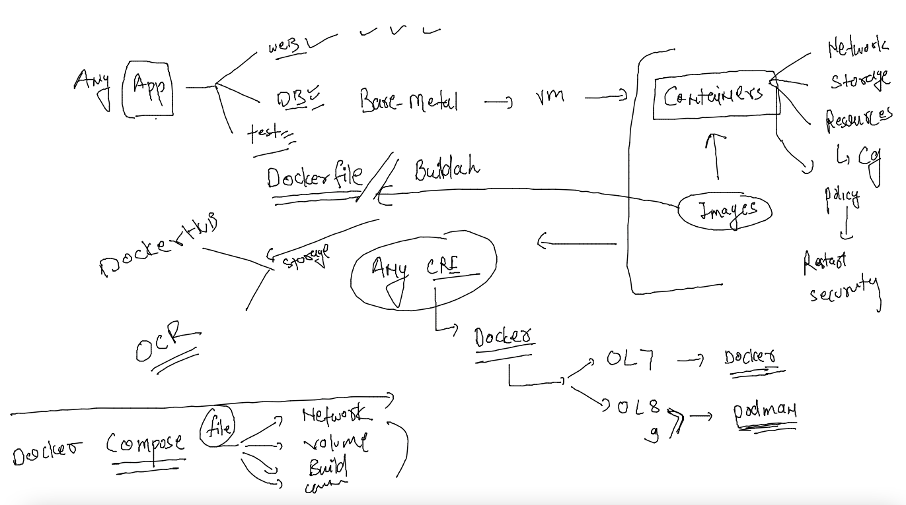
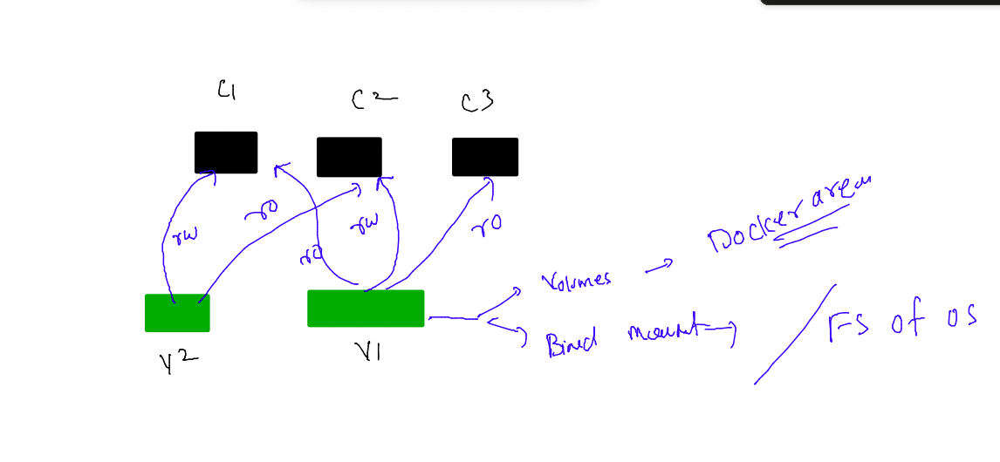
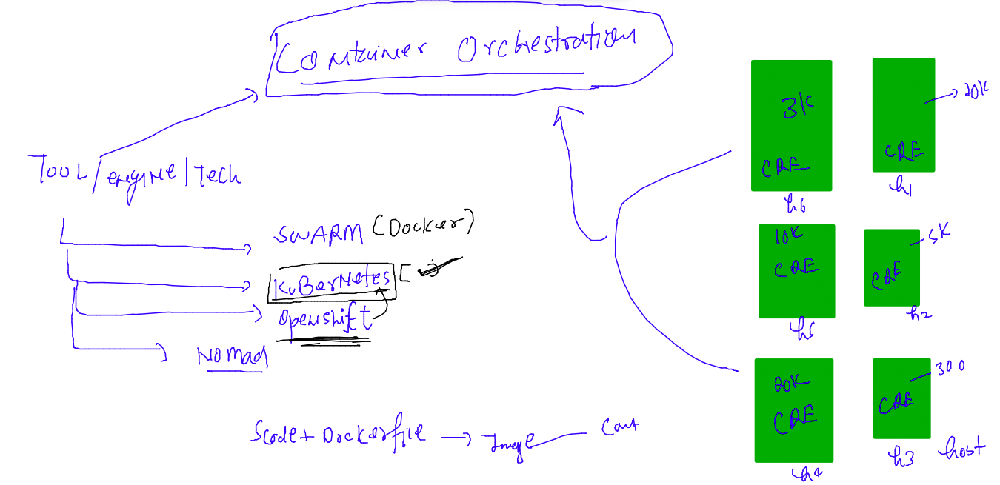
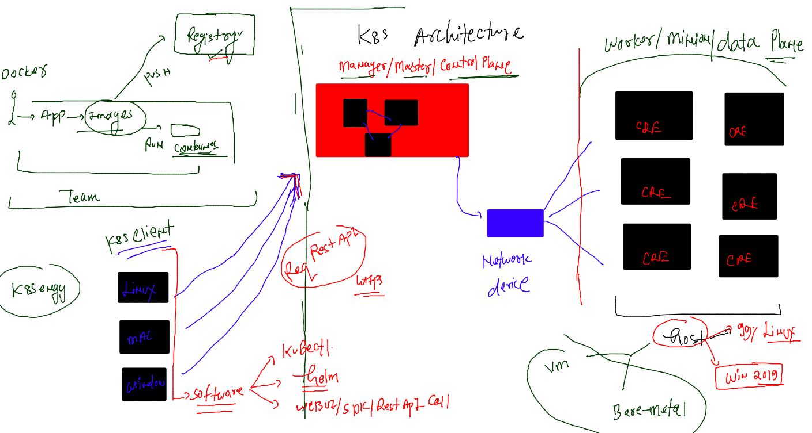

### Revision 



### volume combinations with containers



### two docker volume with single container 

```
[ashu@ip-172-31-87-240 ashu-apps]$ docker volume  create  v1
v1
[ashu@ip-172-31-87-240 ashu-apps]$ docker volume  create  v2
v2
[ashu@ip-172-31-87-240 ashu-apps]$ docker volume inspect  v1
[
    {
        "CreatedAt": "2023-01-04T04:33:09Z",
        "Driver": "local",
        "Labels": {},
        "Mountpoint": "/opt/docker/volumes/v1/_data",
        "Name": "v1",
        "Options": {},
        "Scope": "local"
    }
]
[ashu@ip-172-31-87-240 ashu-apps]$ docker volume inspect  v2
[
    {
        "CreatedAt": "2023-01-04T04:33:11Z",
        "Driver": "local",
        "Labels": {},
        "Mountpoint": "/opt/docker/volumes/v2/_data",
        
============
[ashu@ip-172-31-87-240 ashu-apps]$ docker run -itd --name ashuc1 -v  v1:/mnt/data1:rw  -v  v2:/mnt/data2:ro  alpine 
efd9830be37df829d0b320fd82c4e6dffde90270d2628ac1118c3bba8bdba7e1
[ashu@ip-172-31-87-240 ashu-apps]$ 
[ashu@ip-172-31-87-240 ashu-apps]$ docker ps
CONTAINER ID   IMAGE     COMMAND     CREATED         STATUS         PORTS     NAMES
efd9830be37d   alpine    "/bin/sh"   4 seconds ago   Up 3 seconds             ashuc1
```

### verify container 

```
 360  docker run -itd --name ashuc1 -v  v1:/mnt/data1:rw  -v  v2:/mnt/data2:ro  alpine 
  361  docker ps
  362  docker  inspect  ashuc1
  363  history 
[ashu@ip-172-31-87-240 ashu-apps]$ 
[ashu@ip-172-31-87-240 ashu-apps]$ 
[ashu@ip-172-31-87-240 ashu-apps]$ docker  exec -it ashuc1  sh 
/ # cd  /mnt/
/mnt # ls
data1  data2
/mnt # cd  data1
/mnt/data1 # ls
/mnt/data1 # mkdir hello 
/mnt/data1 # touch a.txt
/mnt/data1 # ls
a.txt  hello
/mnt/data1 # cd ../data2
/mnt/data2 # ls
/mnt/data2 # mkdir hiii
mkdir: can't create directory 'hiii': Read-only file system
/mnt/data2 # exit
```

### mounting same volume to other container 

```
[ashu@ip-172-31-87-240 ashu-apps]$ docker run -itd --name ashuc2   -v  v2:/ashulogs:rw   alpine 
58dd9ecb721f9d405a3124d0e820cb3f7f7d42fb074babe9e34c65e54960cdaf
[ashu@ip-172-31-87-240 ashu-apps]$ 
[ashu@ip-172-31-87-240 ashu-apps]$ docker  exec -it ashuc2  sh 
/ # ls
ashulogs  dev       home      media     opt       root      sbin      sys       usr
bin       etc       lib       mnt       proc      run       srv       tmp       var
/ # cd /ashulogs/
/ashulogs # ls
/ashulogs # echo hii i am data >abc.logs
/ashulogs # ls
abc.logs
/ashulogs # echo hii i am data >abc1.logs
/ashulogs # exit
[ashu@ip-172-31-87-240 ashu-apps]$ 
```

### checking 

```
[ashu@ip-172-31-87-240 ashu-apps]$ docker  exec -it ashuc1  ls  /mnt/data2
[ashu@ip-172-31-87-240 ashu-apps]$ docker  exec -it ashuc1  ls  /mnt/data2
abc.logs
[ashu@ip-172-31-87-240 ashu-apps]$ docker  exec -it ashuc1  ls  /mnt/data2
abc.logs   abc1.logs
[ashu@ip-172-31-87-240 ashu-apps]$ 


```

### accessing volume without container 

```
[root@ip-172-31-87-240 ~]# cd  /opt/docker/
[root@ip-172-31-87-240 docker]# ls
buildkit  containers  image  network  overlay2  plugins  runtimes  swarm  tmp  trust  volumes
[root@ip-172-31-87-240 docker]# cd  volumes/
[root@ip-172-31-87-240 volumes]# ls
backingFsBlockDev  metadata.db  v1  v2
[root@ip-172-31-87-240 volumes]# cd v1
[root@ip-172-31-87-240 v1]# ls
_data
[root@ip-172-31-87-240 v1]# cd _data/
[root@ip-172-31-87-240 _data]# ls
a.txt  hello
[root@ip-172-31-87-240 _data]# cd ..
[root@ip-172-31-87-240 v1]# ls
_data
[root@ip-172-31-87-240 v1]# cd ..
[root@ip-172-31-87-240 volumes]# ls
backingFsBlockDev  metadata.db  v1  v2
[root@ip-172-31-87-240 volumes]# cd v2
[root@ip-172-31-87-240 v2]# ls
_data
[root@ip-172-31-87-240 v2]# cd _data/
[root@ip-172-31-87-240 _data]# ls
abc.logs  abc1.logs
[root@ip-172-31-87-240 _data]#
```
### mounting non docker area inside container without creating any volume 

```
[ashu@ip-172-31-87-240 python_code]$ docker  run -itd --name t1  -v /home/ashu/ashu-apps/python_code:/mnt/new:ro  ashualp:pycodev1
56e541200e22795fef7324dece4d6106a03fbe0802a574cc6b978cb5414d71d1
[ashu@ip-172-31-87-240 python_code]$ docker ps
CONTAINER ID   IMAGE              COMMAND                  CREATED          STATUS          PORTS     NAMES
56e541200e22   ashualp:pycodev1   "/bin/sh -c 'python3…"   3 seconds ago    Up 2 seconds              t1
ad0eee81f728   alpine             "/bin/sh"                9 minutes ago    Up 9 minutes              ankitac2
58dd9ecb721f   alpine             "/bin/sh"                10 minutes ago   Up 10 minutes             ashuc2
46671b8986eb   alpine             "/bin/sh"                18 minutes ago   Up 18 minutes             ankitac1
efd9830be37d   alpine             "/bin/sh"                21 minutes ago   Up 21 minutes             ashuc1
[ashu@ip-172-31-87-240 python_code]$ docker  exec -it t1 sh 
/ # cd  /mnt/new/
/mnt/new # ls
test.py
/mnt/new # python3  test.py 
Hello world
Hello world
^CTraceback (most recent call last):
  File "/mnt/new/test.py", line 4, in <module>
    time.sleep(5)
KeyboardInterrupt

```
### FInal compose and docker example with volume 

```
[ashu@ip-172-31-87-240 ashu-apps]$ ls
ashu-compose  db-apps  java-apps  node-app  python_code  tasks  webapps
[ashu@ip-172-31-87-240 ashu-apps]$ cd  ashu-compose/
[ashu@ip-172-31-87-240 ashu-compose]$ ls
all-compose.yaml  docker-compose.yaml  mysql.yaml
[ashu@ip-172-31-87-240 ashu-compose]$ git clone https://github.com/ShaifArfan/one-page-website-html-css-project.git
Cloning into 'one-page-website-html-css-project'...
remote: Enumerating objects: 52, done.
remote: Counting objects: 100% (52/52), done.
remote: Compressing objects: 100% (36/36), done.
remote: Total 52 (delta 21), reused 41 (delta 15), pack-reused 0
Receiving objects: 100% (52/52), 346.90 KiB | 23.13 MiB/s, done.
Resolving deltas: 100% (21/21), done.
[ashu@ip-172-31-87-240 ashu-compose]$ ls
all-compose.yaml  docker-compose.yaml  mysql.yaml  one-page-website-html-css-project
[ashu@ip-172-31-87-240 ashu-compose]$ 

```

### FInal compose file 

```
version:  '3.8' # compose file version 
networks: # creating two network bridges 
  ashubr1:
  ashubr2:
volumes: # creating two volumes
  ashuvol1:
  ashuvol2: 
services:
  ashu-web-ui:
    image: nginx 
    container_name: ashu-ui-c1 
    ports:
    - "1234:80"
    volumes: # using bind mount 
    - "./one-page-website-html-css-project:/usr/share/nginx/html/"
    networks:
    - ashubr1
    - ashubr2 
  ashu-backend:
    image: adminer 
    container_name: ashu-backend-c1
    ports:
    - "1111:8080"
    networks:
    - ashubr1 
  ashu-db:
    image: mysql
    container_name: ashu-db-c1
    volumes: # docker area volume 
    - "ashuvol1:/var/lib/mysql/"
    environment:
      MYSQL_ROOT_PASSWORD: "OracleD@098"
    env_file:
    - mycred.env 
    networks:
    - ashubr1
```

### lets run it 

```
[ashu@ip-172-31-87-240 ashu-compose]$ ls
all-compose.yaml  docker-compose.yaml  final.yaml  mycred.env  mysql.yaml  one-page-website-html-css-project
[ashu@ip-172-31-87-240 ashu-compose]$ docker-compose  -f final.yaml  up -d 
[+] Running 8/8
 ⠿ ashu-backend Pulled                                                                                                               5.3s
   ⠿ 32de3c850997 Pull complete                                                                                                      3.1s
   ⠿ 8bddad460143 Pull complete                                                                                                      4.7s
   ⠿ 5bf0beaa0412 Pull complete                                                                                                      4.8s
   ⠿ 1e7ee08ea648 Pull complete                                                                                                      4.8s
   ⠿ bd9f958670d2 Pull complete                                                                                                      4.9s
   ⠿ 292984a5d9c1 Pull complete                                                                                                      5.0s
   ⠿ 20a148ad3aa6 Pull complete                                                                                                      5.1s
[+] Running 6/6
 ⠿ Network ashu-compose_ashubr1    Created                                                                                           0.0s
 ⠿ Network ashu-compose_ashubr2    Created                                                                                           0.0s
 ⠿ Volume "ashu-compose_ashuvol1"  Created                                                                                           0.0s
 ⠿ Container ashu-db-c1            Started                                                                                           2.2s
 ⠿ Container ashu-ui-c1            Started                                                                                           2.4s
 ⠿ Container ashu-backend-c1       Started                                                                                           2.4s
[ashu@ip-172-31-87-240 ashu-compose]$ docker-compose  -f final.yaml  ps
NAME                IMAGE               COMMAND                  SERVICE             CREATED             STATUS              PORTS
ashu-backend-c1     adminer             "entrypoint.sh php -…"   ashu-backend        19 seconds ago      Up 17 seconds       0.0.0.0:1111->8080/tcp, :::1111->8080/tcp
ashu-db-c1          mysql               "docker-entrypoint.s…"   ashu-db             19 seconds ago      Up 17 seconds       3306/tcp, 33060/tcp
ashu-ui-c1          nginx               "/docker-entrypoint.…"   ashu-web-ui         19 seconds ago      Up 17 seconds       0.0.0.0:1234->80/tcp, :::1234->80/tcp
[ashu@ip-172-31-87-240 ashu-compose]$ 
```

### done with docker 


```
[ashu@ip-172-31-87-240 ashu-compose]$ docker-compose  -f final.yaml  down 
[+] Running 5/5
 ⠿ Container ashu-db-c1          Removed                                                                                                                         1.3s
 ⠿ Container ashu-ui-c1          Removed                                                                                                                         0.5s
 ⠿ Container ashu-backend-c1     Removed                                                                                                                         0.3s
 ⠿ Network ashu-compose_ashubr2  Removed                                                                                                                         0.1s
 ⠿ Network ashu-compose_ashubr1  Removed 
```

## Introduction to container orchestration engine 



### K8s 3 teir architecture 



### installing kubectl (client of control plane) in Linux machine 

```
[root@ip-172-31-87-240 ~]# curl -LO "https://dl.k8s.io/release/$(curl -L -s https://dl.k8s.io/release/stable.txt)/bin/linux/amd64/kubectl"
  % Total    % Received % Xferd  Average Speed   Time    Time     Time  Current
                                 Dload  Upload   Total   Spent    Left  Speed
100   138  100   138    0     0   3350      0 --:--:-- --:--:-- --:--:--  3365
100 45.7M  100 45.7M    0     0  88.3M      0 --:--:-- --:--:-- --:--:--  105M
[root@ip-172-31-87-240 ~]# ls
kubectl  labs
[root@ip-172-31-87-240 ~]# mv  kubectl  /usr/bin/
[root@ip-172-31-87-240 ~]# chmod +x /usr/bin/kubectl 
[root@ip-172-31-87-240 ~]# kubectl  version --client 
WARNING: This version information is deprecated and will be replaced with the output from kubectl version --short.  Use --output=yaml|json to get the full version.
Client Version: version.Info{Major:"1", Minor:"26", GitVersion:"v1.26.0", GitCommit:"b46a3f887ca979b1a5d14fd39cb1af43e7e5d12d", GitTreeState:"clean", BuildDate:"2022-12-08T19:58:30Z", GoVersion:"go1.19.4", Compiler:"gc", Platform:"linux/amd64"}
Kustomize Version: v4.5.7
[root@ip-172-31-87-240 ~]# 

```

### Installing kubectl on mac 

```
fire@ashutoshhs-MacBook-Air Oracle_dk % curl -LO "https://dl.k8s.io/release/$(curl -L -s https://dl.k8s.io/release/stable.txt)/bin/darwin/amd64/kubectl"
  % Total    % Received % Xferd  Average Speed   Time    Time     Time  Current
                                 Dload  Upload   Total   Spent    Left  Speed
100   138  100   138    0     0    308      0 --:--:-- --:--:-- --:--:--   308
100 51.2M  100 51.2M    0     0  12.9M      0  0:00:03  0:00:03 --:--:-- 17.9M
fire@ashutoshhs-MacBook-Air Oracle_dk % 
fire@ashutoshhs-MacBook-Air Oracle_dk % ls
cgroups	day1	day2	day3	kubectl	mysql
fire@ashutoshhs-MacBook-Air Oracle_dk % sudo mv kubectl  /usr/local/bin 
Password:
fire@ashutoshhs-MacBook-Air Oracle_dk % sudo chmod +x /usr/local/bin/kubectl
fire@ashutoshhs-MacBook-Air Oracle_dk % 
fire@ashutoshhs-MacBook-Air Oracle_dk % kubectl version --client 
WARNING: This version information is deprecated and will be replaced with the output from kubectl version --short.  Use --output=yaml|json to get the full version.
Client Version: version.Info{Major:"1", Minor:"26", GitVersion:"v1.26.0", GitCommit:"b46a3f887ca979b1a5d14fd39cb1af43e7e5d12d", GitTreeState:"clean", BuildDate:"2022-12-08T19:58:30Z", GoVersion:"go1.19.4", Compiler:"gc", Platform:"darwin/amd64"}
Kustomize Version: v4.5.7
fire@ashutoshhs-MacBook-Air Oracle_dk % 


```


