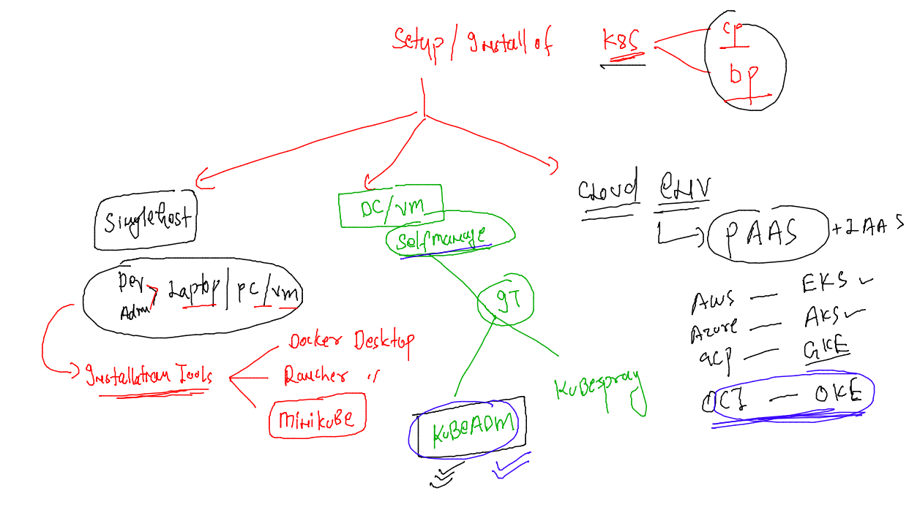
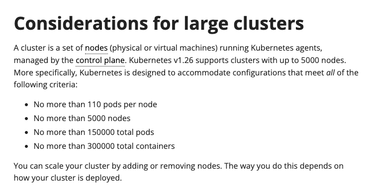
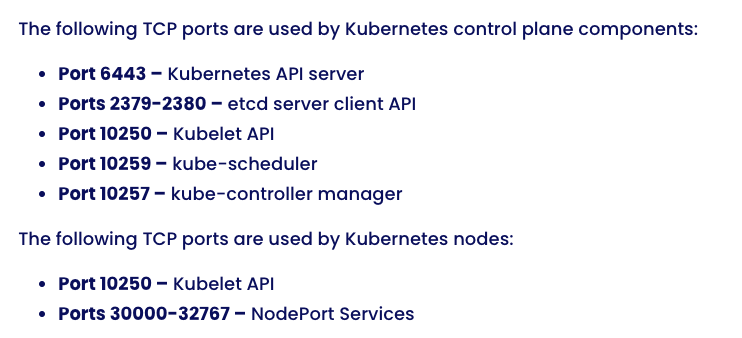
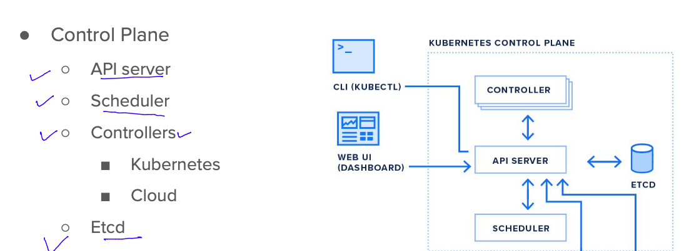
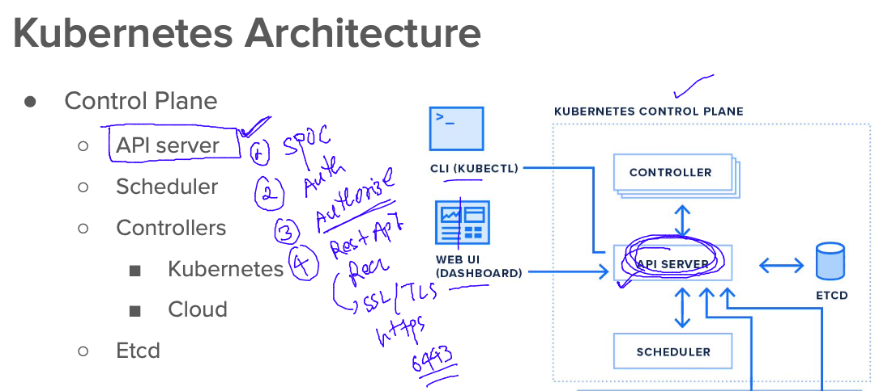
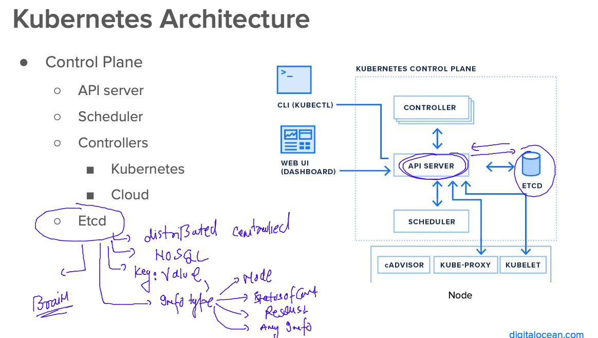
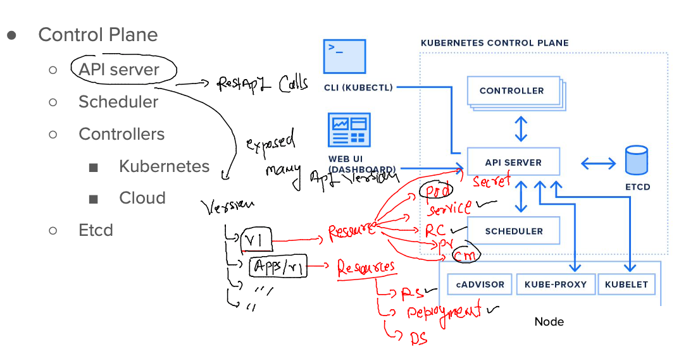
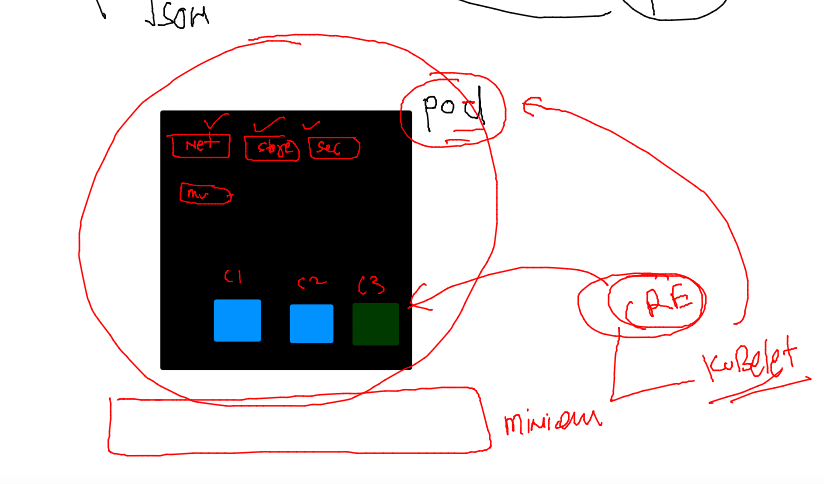

### Revision 


### volume combinations with containers


### two docker volume with single container 

```
[ashu@ip-172-31-87-240 ashu-apps]$ docker volume  create  v1
v1
[ashu@ip-172-31-87-240 ashu-apps]$ docker volume  create  v2
v2
[ashu@ip-172-31-87-240 ashu-apps]$ docker volume inspect  v1
[
    {
        "CreatedAt": "2023-01-04T04:33:09Z",
        "Driver": "local",
        "Labels": {},
        "Mountpoint": "/opt/docker/volumes/v1/_data",
        "Name": "v1",
        "Options": {},
        "Scope": "local"
    }
]
[ashu@ip-172-31-87-240 ashu-apps]$ docker volume inspect  v2
[
    {
        "CreatedAt": "2023-01-04T04:33:11Z",
        "Driver": "local",
        "Labels": {},
        "Mountpoint": "/opt/docker/volumes/v2/_data",
        
============
[ashu@ip-172-31-87-240 ashu-apps]$ docker run -itd --name ashuc1 -v  v1:/mnt/data1:rw  -v  v2:/mnt/data2:ro  alpine 
efd9830be37df829d0b320fd82c4e6dffde90270d2628ac1118c3bba8bdba7e1
[ashu@ip-172-31-87-240 ashu-apps]$ 
[ashu@ip-172-31-87-240 ashu-apps]$ docker ps
CONTAINER ID   IMAGE     COMMAND     CREATED         STATUS         PORTS     NAMES
efd9830be37d   alpine    "/bin/sh"   4 seconds ago   Up 3 seconds             ashuc1
```

### verify container 

```
 360  docker run -itd --name ashuc1 -v  v1:/mnt/data1:rw  -v  v2:/mnt/data2:ro  alpine 
  361  docker ps
  362  docker  inspect  ashuc1
  363  history 
[ashu@ip-172-31-87-240 ashu-apps]$ 
[ashu@ip-172-31-87-240 ashu-apps]$ 
[ashu@ip-172-31-87-240 ashu-apps]$ docker  exec -it ashuc1  sh 
/ # cd  /mnt/
/mnt # ls
data1  data2
/mnt # cd  data1
/mnt/data1 # ls
/mnt/data1 # mkdir hello 
/mnt/data1 # touch a.txt
/mnt/data1 # ls
a.txt  hello
/mnt/data1 # cd ../data2
/mnt/data2 # ls
/mnt/data2 # mkdir hiii
mkdir: can't create directory 'hiii': Read-only file system
/mnt/data2 # exit
```

### mounting same volume to other container 

```
[ashu@ip-172-31-87-240 ashu-apps]$ docker run -itd --name ashuc2   -v  v2:/ashulogs:rw   alpine 
58dd9ecb721f9d405a3124d0e820cb3f7f7d42fb074babe9e34c65e54960cdaf
[ashu@ip-172-31-87-240 ashu-apps]$ 
[ashu@ip-172-31-87-240 ashu-apps]$ docker  exec -it ashuc2  sh 
/ # ls
ashulogs  dev       home      media     opt       root      sbin      sys       usr
bin       etc       lib       mnt       proc      run       srv       tmp       var
/ # cd /ashulogs/
/ashulogs # ls
/ashulogs # echo hii i am data >abc.logs
/ashulogs # ls
abc.logs
/ashulogs # echo hii i am data >abc1.logs
/ashulogs # exit
[ashu@ip-172-31-87-240 ashu-apps]$ 
```

### checking 

```
[ashu@ip-172-31-87-240 ashu-apps]$ docker  exec -it ashuc1  ls  /mnt/data2
[ashu@ip-172-31-87-240 ashu-apps]$ docker  exec -it ashuc1  ls  /mnt/data2
abc.logs
[ashu@ip-172-31-87-240 ashu-apps]$ docker  exec -it ashuc1  ls  /mnt/data2
abc.logs   abc1.logs
[ashu@ip-172-31-87-240 ashu-apps]$ 


```

### accessing volume without container 

```
[root@ip-172-31-87-240 ~]# cd  /opt/docker/
[root@ip-172-31-87-240 docker]# ls
buildkit  containers  image  network  overlay2  plugins  runtimes  swarm  tmp  trust  volumes
[root@ip-172-31-87-240 docker]# cd  volumes/
[root@ip-172-31-87-240 volumes]# ls
backingFsBlockDev  metadata.db  v1  v2
[root@ip-172-31-87-240 volumes]# cd v1
[root@ip-172-31-87-240 v1]# ls
_data
[root@ip-172-31-87-240 v1]# cd _data/
[root@ip-172-31-87-240 _data]# ls
a.txt  hello
[root@ip-172-31-87-240 _data]# cd ..
[root@ip-172-31-87-240 v1]# ls
_data
[root@ip-172-31-87-240 v1]# cd ..
[root@ip-172-31-87-240 volumes]# ls
backingFsBlockDev  metadata.db  v1  v2
[root@ip-172-31-87-240 volumes]# cd v2
[root@ip-172-31-87-240 v2]# ls
_data
[root@ip-172-31-87-240 v2]# cd _data/
[root@ip-172-31-87-240 _data]# ls
abc.logs  abc1.logs
[root@ip-172-31-87-240 _data]#
```
### mounting non docker area inside container without creating any volume 

```
[ashu@ip-172-31-87-240 python_code]$ docker  run -itd --name t1  -v /home/ashu/ashu-apps/python_code:/mnt/new:ro  ashualp:pycodev1
56e541200e22795fef7324dece4d6106a03fbe0802a574cc6b978cb5414d71d1
[ashu@ip-172-31-87-240 python_code]$ docker ps
CONTAINER ID   IMAGE              COMMAND                  CREATED          STATUS          PORTS     NAMES
56e541200e22   ashualp:pycodev1   "/bin/sh -c 'python3…"   3 seconds ago    Up 2 seconds              t1
ad0eee81f728   alpine             "/bin/sh"                9 minutes ago    Up 9 minutes              ankitac2
58dd9ecb721f   alpine             "/bin/sh"                10 minutes ago   Up 10 minutes             ashuc2
46671b8986eb   alpine             "/bin/sh"                18 minutes ago   Up 18 minutes             ankitac1
efd9830be37d   alpine             "/bin/sh"                21 minutes ago   Up 21 minutes             ashuc1
[ashu@ip-172-31-87-240 python_code]$ docker  exec -it t1 sh 
/ # cd  /mnt/new/
/mnt/new # ls
test.py
/mnt/new # python3  test.py 
Hello world
Hello world
^CTraceback (most recent call last):
  File "/mnt/new/test.py", line 4, in <module>
    time.sleep(5)
KeyboardInterrupt

```
### FInal compose and docker example with volume 

```
[ashu@ip-172-31-87-240 ashu-apps]$ ls
ashu-compose  db-apps  java-apps  node-app  python_code  tasks  webapps
[ashu@ip-172-31-87-240 ashu-apps]$ cd  ashu-compose/
[ashu@ip-172-31-87-240 ashu-compose]$ ls
all-compose.yaml  docker-compose.yaml  mysql.yaml
[ashu@ip-172-31-87-240 ashu-compose]$ git clone https://github.com/ShaifArfan/one-page-website-html-css-project.git
Cloning into 'one-page-website-html-css-project'...
remote: Enumerating objects: 52, done.
remote: Counting objects: 100% (52/52), done.
remote: Compressing objects: 100% (36/36), done.
remote: Total 52 (delta 21), reused 41 (delta 15), pack-reused 0
Receiving objects: 100% (52/52), 346.90 KiB | 23.13 MiB/s, done.
Resolving deltas: 100% (21/21), done.
[ashu@ip-172-31-87-240 ashu-compose]$ ls
all-compose.yaml  docker-compose.yaml  mysql.yaml  one-page-website-html-css-project
[ashu@ip-172-31-87-240 ashu-compose]$ 

```

### FInal compose file 

```
version:  '3.8' # compose file version 
networks: # creating two network bridges 
  ashubr1:
  ashubr2:
volumes: # creating two volumes
  ashuvol1:
  ashuvol2: 
services:
  ashu-web-ui:
    image: nginx 
    container_name: ashu-ui-c1 
    ports:
    - "1234:80"
    volumes: # using bind mount 
    - "./one-page-website-html-css-project:/usr/share/nginx/html/"
    networks:
    - ashubr1
    - ashubr2 
  ashu-backend:
    image: adminer 
    container_name: ashu-backend-c1
    ports:
    - "1111:8080"
    networks:
    - ashubr1 
  ashu-db:
    image: mysql
    container_name: ashu-db-c1
    volumes: # docker area volume 
    - "ashuvol1:/var/lib/mysql/"
    environment:
      MYSQL_ROOT_PASSWORD: "OracleD@098"
    env_file:
    - mycred.env 
    networks:
    - ashubr1
```

### lets run it 

```
[ashu@ip-172-31-87-240 ashu-compose]$ ls
all-compose.yaml  docker-compose.yaml  final.yaml  mycred.env  mysql.yaml  one-page-website-html-css-project
[ashu@ip-172-31-87-240 ashu-compose]$ docker-compose  -f final.yaml  up -d 
[+] Running 8/8
 ⠿ ashu-backend Pulled                                                                                                               5.3s
   ⠿ 32de3c850997 Pull complete                                                                                                      3.1s
   ⠿ 8bddad460143 Pull complete                                                                                                      4.7s
   ⠿ 5bf0beaa0412 Pull complete                                                                                                      4.8s
   ⠿ 1e7ee08ea648 Pull complete                                                                                                      4.8s
   ⠿ bd9f958670d2 Pull complete                                                                                                      4.9s
   ⠿ 292984a5d9c1 Pull complete                                                                                                      5.0s
   ⠿ 20a148ad3aa6 Pull complete                                                                                                      5.1s
[+] Running 6/6
 ⠿ Network ashu-compose_ashubr1    Created                                                                                           0.0s
 ⠿ Network ashu-compose_ashubr2    Created                                                                                           0.0s
 ⠿ Volume "ashu-compose_ashuvol1"  Created                                                                                           0.0s
 ⠿ Container ashu-db-c1            Started                                                                                           2.2s
 ⠿ Container ashu-ui-c1            Started                                                                                           2.4s
 ⠿ Container ashu-backend-c1       Started                                                                                           2.4s
[ashu@ip-172-31-87-240 ashu-compose]$ docker-compose  -f final.yaml  ps
NAME                IMAGE               COMMAND                  SERVICE             CREATED             STATUS              PORTS
ashu-backend-c1     adminer             "entrypoint.sh php -…"   ashu-backend        19 seconds ago      Up 17 seconds       0.0.0.0:1111->8080/tcp, :::1111->8080/tcp
ashu-db-c1          mysql               "docker-entrypoint.s…"   ashu-db             19 seconds ago      Up 17 seconds       3306/tcp, 33060/tcp
ashu-ui-c1          nginx               "/docker-entrypoint.…"   ashu-web-ui         19 seconds ago      Up 17 seconds       0.0.0.0:1234->80/tcp, :::1234->80/tcp
[ashu@ip-172-31-87-240 ashu-compose]$ 
```

### done with docker 


```
[ashu@ip-172-31-87-240 ashu-compose]$ docker-compose  -f final.yaml  down 
[+] Running 5/5
 ⠿ Container ashu-db-c1          Removed                                                                                                                         1.3s
 ⠿ Container ashu-ui-c1          Removed                                                                                                                         0.5s
 ⠿ Container ashu-backend-c1     Removed                                                                                                                         0.3s
 ⠿ Network ashu-compose_ashubr2  Removed                                                                                                                         0.1s
 ⠿ Network ashu-compose_ashubr1  Removed 
```

## Introduction to container orchestration engine 


### K8s 3 teir architecture 


### installing kubectl (client of control plane) in Linux machine 

```
[root@ip-172-31-87-240 ~]# curl -LO "https://dl.k8s.io/release/$(curl -L -s https://dl.k8s.io/release/stable.txt)/bin/linux/amd64/kubectl"
  % Total    % Received % Xferd  Average Speed   Time    Time     Time  Current
                                 Dload  Upload   Total   Spent    Left  Speed
100   138  100   138    0     0   3350      0 --:--:-- --:--:-- --:--:--  3365
100 45.7M  100 45.7M    0     0  88.3M      0 --:--:-- --:--:-- --:--:--  105M
[root@ip-172-31-87-240 ~]# ls
kubectl  labs
[root@ip-172-31-87-240 ~]# mv  kubectl  /usr/bin/
[root@ip-172-31-87-240 ~]# chmod +x /usr/bin/kubectl 
[root@ip-172-31-87-240 ~]# kubectl  version --client 
WARNING: This version information is deprecated and will be replaced with the output from kubectl version --short.  Use --output=yaml|json to get the full version.
Client Version: version.Info{Major:"1", Minor:"26", GitVersion:"v1.26.0", GitCommit:"b46a3f887ca979b1a5d14fd39cb1af43e7e5d12d", GitTreeState:"clean", BuildDate:"2022-12-08T19:58:30Z", GoVersion:"go1.19.4", Compiler:"gc", Platform:"linux/amd64"}
Kustomize Version: v4.5.7
[root@ip-172-31-87-240 ~]# 

```

### Installing kubectl on mac 

```
fire@ashutoshhs-MacBook-Air Oracle_dk % curl -LO "https://dl.k8s.io/release/$(curl -L -s https://dl.k8s.io/release/stable.txt)/bin/darwin/amd64/kubectl"
  % Total    % Received % Xferd  Average Speed   Time    Time     Time  Current
                                 Dload  Upload   Total   Spent    Left  Speed
100   138  100   138    0     0    308      0 --:--:-- --:--:-- --:--:--   308
100 51.2M  100 51.2M    0     0  12.9M      0  0:00:03  0:00:03 --:--:-- 17.9M
fire@ashutoshhs-MacBook-Air Oracle_dk % 
fire@ashutoshhs-MacBook-Air Oracle_dk % ls
cgroups	day1	day2	day3	kubectl	mysql
fire@ashutoshhs-MacBook-Air Oracle_dk % sudo mv kubectl  /usr/local/bin 
Password:
fire@ashutoshhs-MacBook-Air Oracle_dk % sudo chmod +x /usr/local/bin/kubectl
fire@ashutoshhs-MacBook-Air Oracle_dk % 
fire@ashutoshhs-MacBook-Air Oracle_dk % kubectl version --client 
WARNING: This version information is deprecated and will be replaced with the output from kubectl version --short.  Use --output=yaml|json to get the full version.
Client Version: version.Info{Major:"1", Minor:"26", GitVersion:"v1.26.0", GitCommit:"b46a3f887ca979b1a5d14fd39cb1af43e7e5d12d", GitTreeState:"clean", BuildDate:"2022-12-08T19:58:30Z", GoVersion:"go1.19.4", Compiler:"gc", Platform:"darwin/amd64"}
Kustomize Version: v4.5.7
fire@ashutoshhs-MacBook-Air Oracle_dk % 


```

## Options for setting up k8s env 



### large cluster consideration 



### firewall ports to open in prod env 



### components to setup on control plane



### components to setup on worker nodes /data plane 


## script to run in all the system 

```
[root@minion1 ~]# cat s.sh 
# disable SElinux secuirty 
setenforce  0
sed -i 's/SELINUX=enforcing/SELINUX=disabled/'  /etc/selinux/config

# disable swap memory 

swapoff  -a

# enable linux kernel firewall bridge module for CNI 
modprobe br_netfilter
echo '1' > /proc/sys/net/bridge/bridge-nf-call-iptables

# installing any CRE 
yum  install  docker -y 
# configure it 

cat  <<X  >/etc/docker/daemon.json
{
  "exec-opts": ["native.cgroupdriver=systemd"]
}

X

# starting docker 
systemctl enable --now  docker

# install kubeadm 
cat  <<EOF  >/etc/yum.repos.d/kube.repo
[kube]
baseurl=https://packages.cloud.google.com/yum/repos/kubernetes-el7-x86_64
gpgcheck=0
EOF

yum install kubeadm -y 
systemctl enable --now  kubelet
```

### only on master Node / control plane 

```
[root@control-plane ~]# kubeadm  init --pod-network-cidr=192.168.0.0/16  --apiserver-advertise-address=0.0.0.0   --apiserver-cert-extra-sans=129.146.169.201
[init] Using Kubernetes version: v1.26.0
[preflight] Running pre-flight checks
	[WARNING Firewalld]: firewalld is active, please ensure ports [6443 10250] are open or your cluster may not function correctly
[preflight] Pulling images required for setting up a Kubernetes cluster
[preflight] This might take a minute or two, depending on the speed of your internet connection
[preflight] You can also perform this action in beforehand using 'kubeadm config images pull'
[certs] Using certificateDir folder "/etc/kubernetes/pki"
[certs] Generating "ca" certificate and key
[certs] Generating "apiserver" certificate and key
[certs] apiserver serving cert is signed for DNS names [control-plane kubernetes kubernetes.default kubernetes.default.svc kubernetes.default.svc.cluster.local] and IPs [10.96.0.1 10.0.0.215 129.146.169.201]
[certs] Generating "apiserver-kubelet-client" certificate and key
[certs] Generating "front-proxy-ca" certificate and key
[certs] Generating "front-proxy-client" certificate and key
[certs] Generating "etcd/ca" certificate and key

```

## Components of control plane 

### kube-apiServer 



### auth file of api-server on control plane 

```
[root@master ~]# cd  /etc/kubernetes/
[root@master kubernetes]# ls
admin.conf
```
### file to download on client k8s system 

```
[ashu@ip-172-31-87-240 ashu-apps]$ wget  http://158.101.3.169/admin.conf 
--2023-01-04 09:02:51--  http://158.101.3.169/admin.conf
Connecting to 158.101.3.169:80... connected.
HTTP request sent, awaiting response... 200 OK
Length: 5641 (5.5K) [text/plain]
Saving to: ‘admin.conf’

100%[================================================================================================>] 5,641       --.-K/s   in 0s      

2023-01-04 09:02:51 (473 MB/s) - ‘admin.conf’ saved [5641/5641]

[ashu@ip-172-31-87-240 ashu-apps]$ ls
admin.conf  ashu-compose  db-apps  java-apps  node-app  python_code  tasks  webapps
[ashu@ip-172-31-87-240 ashu-apps]$ 

```

### sending first request from k8s client to master Node 

```
[ashu@ip-172-31-87-240 ashu-apps]$ kubectl  get  nodes   --kubeconfig  admin.conf 
NAME      STATUS   ROLES                  AGE   VERSION
master    Ready    control-plane,master   60m   v1.23.15
minion1   Ready    <none>                 53m   v1.23.15
minion2   Ready    <none>                 18m   v1.23.15
[ashu@ip-172-31-87-240 ashu-apps]$ 
```

### 

```
[ashu@ip-172-31-87-240 ashu-apps]$ kubectl  cluster-info  --kubeconfig admin.conf 
Kubernetes control plane is running at https://158.101.3.169:6443
CoreDNS is running at https://158.101.3.169:6443/api/v1/namespaces/kube-system/services/kube-dns:dns/proxy

```

### copy admin.conf in desired location 

```
[ashu@ip-172-31-87-240 ashu-apps]$ mkdir  ~/.kube
mkdir: cannot create directory ‘/home/ashu/.kube’: File exists
[ashu@ip-172-31-87-240 ashu-apps]$ cp -v admin.conf   ~/.kube/config 
‘admin.conf’ -> ‘/home/ashu/.kube/config’
[ashu@ip-172-31-87-240 ashu-apps]$ 
[ashu@ip-172-31-87-240 ashu-apps]$ kubectl  get  nodes   
NAME      STATUS   ROLES                  AGE   VERSION
master    Ready    control-plane,master   63m   v1.23.15
minion1   Ready    <none>                 56m   v1.23.15
minion2   Ready    <none>                 20m   v1.23.15
[ashu@ip-172-31-87-240 ashu-apps]$ 
```

### etcd in control plane 



## lets deploy java webapp in k8s 

### build docker image for java webapp 

```
[ashu@ip-172-31-87-240 ashu-apps]$ ls
admin.conf  ashu-compose  db-apps  java-apps  node-app  python_code  tasks  webapps
[ashu@ip-172-31-87-240 ashu-apps]$ cd  webapps/
[ashu@ip-172-31-87-240 webapps]$ ls
Dockerfile  project-html-website
[ashu@ip-172-31-87-240 webapps]$ git clone https://github.com/redashu/javawebapp.git
Cloning into 'javawebapp'...
remote: Enumerating objects: 86, done.
remote: Counting objects: 100% (86/86), done.
remote: Compressing objects: 100% (81/81), done.
remote: Total 86 (delta 33), reused 7 (delta 0), pack-reused 0
Receiving objects: 100% (86/86), 54.04 KiB | 6.75 MiB/s, done.
Resolving deltas: 100% (33/33), done.
[ashu@ip-172-31-87-240 webapps]$ ls
Dockerfile  javawebapp  project-html-website
[ashu@ip-172-31-87-240 webapps]$ 
```

### build and push 

```
17  docker build -t  dockerashu/oraclejava:webappv1  . 
  418  history 
  419  docker login 
  420  history 
  421  docker push dockerashu/oraclejava:webappv1
```

### Understanding YAML apiVersion resources 



### listing 

```
[ashu@ip-172-31-87-240 ashu-apps]$ kubectl  api-resources 
NAME                              SHORTNAMES   APIVERSION                             NAMESPACED   KIND
bindings                                       v1                                     true         Binding
componentstatuses                 cs           v1                                     false        ComponentStatus
configmaps                        cm           v1                                     true         ConfigMap
endpoints                         ep           v1                                     true         Endpoints
```


### creating pod YAML 




```
apiVersion: v1 
kind: Pod
metadata: # info about Resource 
  name: ashupod-123  # name of Pod 
spec: # app related data 
  containers:
  - name: ashuc1
    image: docker.io/dockerashu/oraclejava:webappv1 # image from docker hub 
    ports: # default app port optional part 
    - containerPort: 8080 
```

### lets deploy it 

```
[ashu@ip-172-31-87-240 ashu-apps]$ ls
ashu-compose  db-apps  java-apps  k8s-resources  node-app  python_code  tasks  webapps
[ashu@ip-172-31-87-240 ashu-apps]$ cd k8s-resources/
[ashu@ip-172-31-87-240 k8s-resources]$ ls
ashupod1.yaml
[ashu@ip-172-31-87-240 k8s-resources]$ kubectl apply -f ashupod1.yaml 
pod/ashupod-123 created
[ashu@ip-172-31-87-240 k8s-resources]$ kubectl   get  pods
NAME           READY   STATUS              RESTARTS   AGE
ashupod-123    0/1     ContainerCreating   0          7s
sibashis-123   0/1     ContainerCreating   0          5s
[ashu@ip-172-31-87-240 k8s-resources]$ kubectl   get  pods
NAME             READY   STATUS    RESTARTS   AGE
ashupod-123      1/1     Running   0          24s
nishantpod-123   1/1     Running   0          10s
sibashis-123     1/1     Running   0          22s
```

### all pods status 

```
[ashu@ip-172-31-87-240 k8s-resources]$ kubectl  get  nodes
NAME      STATUS   ROLES                  AGE    VERSION
master    Ready    control-plane,master   122m   v1.23.15
minion1   Ready    <none>                 115m   v1.23.15
minion2   Ready    <none>                 80m    v1.23.15
[ashu@ip-172-31-87-240 k8s-resources]$ kubectl   get  pods -o wide
NAME             READY   STATUS    RESTARTS   AGE     IP                NODE      NOMINATED NODE   READINESS GATES
anandpod-123     1/1     Running   0          6m2s    192.168.34.3      minion1   <none>           <none>
ankitapod-123    1/1     Running   0          4m      192.168.34.4      minion1   <none>           <none>
ashupod-123      1/1     Running   0          7m59s   192.168.179.193   minion2   <none>           <none>
mypod            1/1     Running   0          5m6s    192.168.179.196   minion2   <none>           <none>
```

### describe pod 

```
[ashu@ip-172-31-87-240 k8s-resources]$ kubectl  describe  pod  ashupod-123 
Name:             ashupod-123
Namespace:        default
Priority:         0
Service Account:  default
Node:             minion2/10.0.0.240
Start Time:       Wed, 04 Jan 2023 10:04:12 +0000
Labels:           <none>
Annotations:      cni.projectcalico.org/containerID: 6713839cee08aeb96d70cbfe3d83adb0521217277783435f2a9429eee3b00659
                  cni.projectcalico.org/podIP: 192.168.179.193/32
                  cni.projectcalico.org/podIPs: 192.168.179.193/32
Status:           Running
IP:               192.168.179.193
IPs:
  IP:  192.168.179.193
Containers:
  ashuc1:
    Container ID:   docker://5255db42580d14fc7f01c44ca9f8f408def324453106ca1534aab24ac19b3343
    Image:          docker.io/dockerashu/oraclejava:webappv1
    Image ID:       docker-pullable://dockerashu/oraclejava@sha256:d175faaecc1c0e7d887685501589f2f09ab0b237b47f6f3d5181b82ba2bb8c80
    Port:           8080/TCP
    Host Port:      0/TCP
    State:          Running
      Started:      Wed, 04 Jan 2023 10:04:30 +0000
    Ready:          True
```

### accessing container inside pod 

```
[ashu@ip-172-31-87-240 k8s-resources]$ kubectl  exec -it  ashupod-123  -- bash 
root@ashupod-123:/usr/local/tomcat/webapps/ashu# 
root@ashupod-123:/usr/local/tomcat/webapps/ashu# 
root@ashupod-123:/usr/local/tomcat/webapps/ashu# 
root@ashupod-123:/usr/local/tomcat/webapps/ashu# ls
devops.png  index.html  WEB-INF  welcome.jsp
root@ashupod-123:/usr/local/tomcat/webapps/ashu# cd /
root@ashupod-123:/# ls
bin  boot  dev  etc  home  lib  lib32  lib64  libx32  media  mnt  opt  proc  root  run  sbin  srv  sys  tmp  usr  var
root@ashupod-123:/# exit
exit
[ashu@ip-172-31-87-240 k8s-resources]$ 
```

### logs 

```
[ashu@ip-172-31-87-240 k8s-resources]$ kubectl  logs  ashupod-123
04-Jan-2023 10:04:31.258 INFO [main] org.apache.catalina.startup.VersionLoggerListener.log Server version name:   Apache Tomcat/10.1.4
04-Jan-2023 10:04:31.262 INFO [main] org.apache.catalina.startup.VersionLoggerListener.log Server built:          Dec 5 2022 16:30:12 UTC
04-Jan-2023 10:04:31.262 INFO [main] org.apache.catalina.startup.VersionLoggerListener.log Server version number: 10.1.4.0
04-Jan-2023 10:04:31.262 INFO [main] org.apache.catalina.startup.VersionLoggerListener.log OS Name:               Linux
04-Jan-2023 10:04:31.262 INFO [main] org.apache.catalina.startup.VersionLoggerListener.log OS Version:            5.4.17-2136.314.6.2.el7uek.x86_64
```

### yaml and json print of a running pod 

```
451  kubectl  get pod  ashupod-123  -o yaml 
  452  kubectl  get pod  ashupod-123  -o json 
```

### deleting 

```
[ashu@ip-172-31-87-240 k8s-resources]$ kubectl  delete pod ashupod-123
pod "ashupod-123" deleted
```


