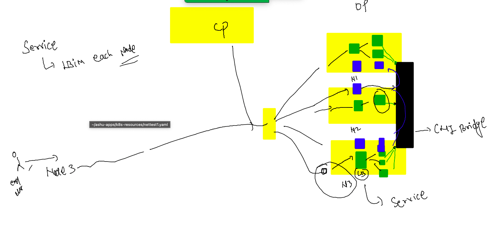
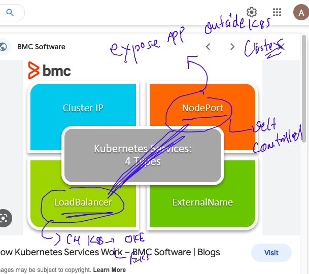
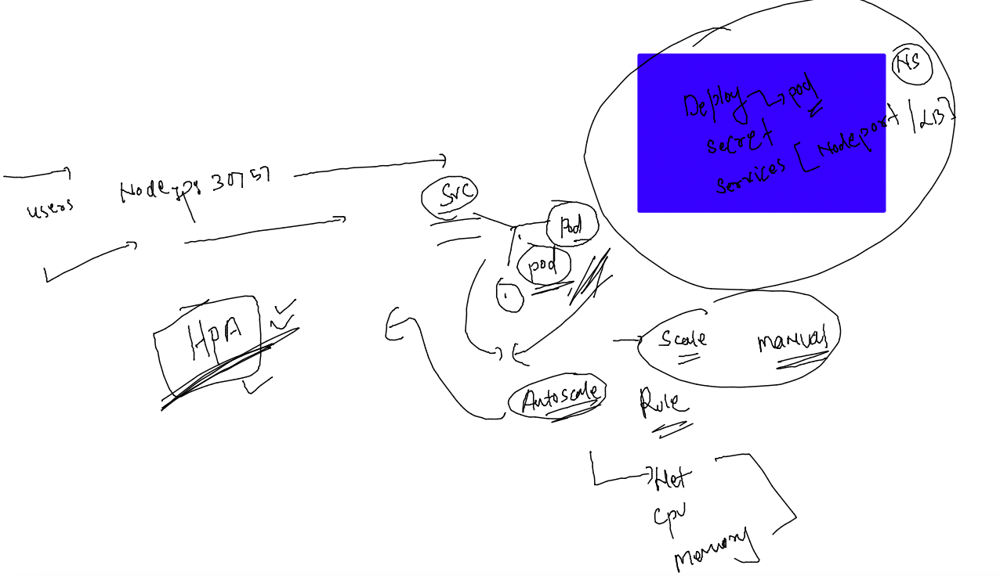
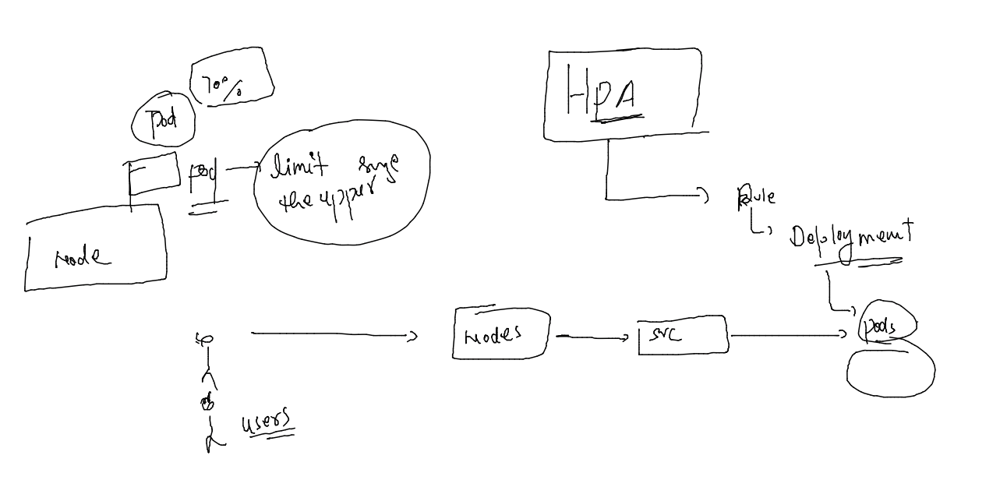
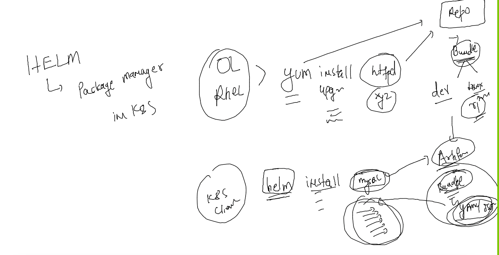

### getting started with Namespaces in K8s 


### listing namespaces 

```
[ashu@ip-172-31-87-240 ashu-apps]$ kubectl  get  namespaces 
NAME              STATUS   AGE
default           Active   20h
kube-node-lease   Active   20h
kube-public       Active   20h
kube-system       Active   20h
[ashu@ip-172-31-87-240 ashu-apps]$ kubectl   get  pods
No resources found in default namespace.
[ashu@ip-172-31-87-240 ashu-apps]$ 
[ashu@ip-172-31-87-240 ashu-apps]$ whoami
ashu
[ashu@ip-172-31-87-240 ashu-apps]$
```
### creating ns and set as default 

```
[ashu@ip-172-31-87-240 k8s-resources]$ kubectl  create  namespace  ashu-project --dry-run=client -o yaml 
apiVersion: v1
kind: Namespace
metadata:
  creationTimestamp: null
  name: ashu-project
spec: {}
status: {}
[ashu@ip-172-31-87-240 k8s-resources]$ kubectl  create  namespace  ashu-project 
namespace/ashu-project created
[ashu@ip-172-31-87-240 k8s-resources]$ kubectl  get  ns
NAME              STATUS   AGE
ashu-project      Active   4s
default           Active   20h
kube-node-lease   Active   20h
kube-public       Active   20h
kube-system       Active   20h
[ashu@ip-172-31-87-240 k8s-resources]$ kubectl  config set-context --current --namespace=ashu-project 
Context "kubernetes-admin@kubernetes" modified.
[ashu@ip-172-31-87-240 k8s-resources]$ kubectl  get  pods
No resources found in ashu-project namespace.
[ashu@ip-172-31-87-240 k8s-resources]$ 
[ashu@ip-172-31-87-240 k8s-resources]$ 
```

### checking default ns 

```
[ashu@ip-172-31-87-240 k8s-resources]$ kubectl  config  get-contexts 
CURRENT   NAME                          CLUSTER      AUTHINFO           NAMESPACE
*         kubernetes-admin@kubernetes   kubernetes   kubernetes-admin   ashu-project
[ashu@ip-172-31-87-240 k8s-resources]$ 
```

### doing the same in personal namespace 

```
[ashu@ip-172-31-87-240 k8s-resources]$ ls
ashupod1.yaml  autopod.json  autopod.yaml  mysecret.yaml  ocrpod.yaml
[ashu@ip-172-31-87-240 k8s-resources]$ 
[ashu@ip-172-31-87-240 k8s-resources]$ 
[ashu@ip-172-31-87-240 k8s-resources]$ kubectl apply -f mysecret.yaml  -f  ocrpod.yaml 
secret/ashu-reg-secret created
pod/ashunewpod created
[ashu@ip-172-31-87-240 k8s-resources]$ kubectl  get  secret 
NAME                  TYPE                                  DATA   AGE
ashu-reg-secret       kubernetes.io/dockerconfigjson        1      10s
default-token-xnpnd   kubernetes.io/service-account-token   3      4m18s
[ashu@ip-172-31-87-240 k8s-resources]$ kubectl  get  po
NAME         READY   STATUS    RESTARTS   AGE
ashunewpod   1/1     Running   0          14s
[ashu@ip-172-31-87-240 k8s-resources]$ kubectl delete -f mysecret.yaml  -f ocrpod.yaml 
secret "ashu-reg-secret" deleted
pod "ashunewpod" deleted
[ashu@ip-172-31-87-240 k8s-resources]$ 
```

## Introduction to k8s controllers 


### stateless vs statefull apps in k8s 


### creating deployment yaml 

```
kubectl  create  deployment  ashu-deploy1  --image=docker.io/dockerashu/oraclejava:webappv1  --port  8080 --dry-run=client -o yaml >mydeploy.yaml
```

### YAML 

```
apiVersion: apps/v1
kind: Deployment
metadata:
  creationTimestamp: null
  labels:
    app: ashu-deploy1
  name: ashu-deploy1 # name of deployment 
spec:
  replicas: 1 # number of pod we want 
  selector:
    matchLabels:
      app: ashu-deploy1
  strategy: {}
  template: # to create pods deployment will be using template of pod
    metadata:
      creationTimestamp: null
      labels:
        app: ashu-deploy1
    spec:
      containers:
      - image: docker.io/dockerashu/oraclejava:webappv1
        name: oraclejava
        ports:
        - containerPort: 8080
        resources: {}
status: {}

```

### deploy it 

```
[ashu@ip-172-31-87-240 k8s-resources]$ kubectl apply -f mydeploy.yaml 
deployment.apps/ashu-deploy1 created
[ashu@ip-172-31-87-240 k8s-resources]$ 
[ashu@ip-172-31-87-240 k8s-resources]$ kubectl  get  deployment 
NAME           READY   UP-TO-DATE   AVAILABLE   AGE
ashu-deploy1   1/1     1            1           6s
[ashu@ip-172-31-87-240 k8s-resources]$ kubectl  get pods
NAME                           READY   STATUS    RESTARTS   AGE
ashu-deploy1-7d7d754b6-9lhfw   1/1     Running   0          17s
[ashu@ip-172-31-87-240 k8s-resources]$ kubectl delete pod ashu-deploy1-7d7d754b6-9lhfw
pod "ashu-deploy1-7d7d754b6-9lhfw" deleted
[ashu@ip-172-31-87-240 k8s-resources]$ kubectl  get pods
NAME                           READY   STATUS    RESTARTS   AGE
ashu-deploy1-7d7d754b6-wvkbq   1/1     Running   0          4s
[ashu@ip-172-31-87-240 k8s-resources]$ 
```

### using secret in deployment file 

```
apiVersion: apps/v1
kind: Deployment
metadata:
  creationTimestamp: null
  labels:
    app: ashu-deploy1
  name: ashu-deploy1
spec:
  replicas: 1
  selector:
    matchLabels:
      app: ashu-deploy1
  strategy: {}
  template: # this is of pod 
    metadata:
      creationTimestamp: null
      labels:
        app: ashu-deploy1
    spec:
      imagePullSecrets:
      - name: ashu-reg-secret
      containers:
      - image: phx.ocir.io/ax8yv0ztaclr/newapp:v1
        name: newapp
        ports:
        - containerPort: 8080
        resources: {}
status: {}

```

### Scaling of POds 


### manul scaling of pod 

```
[ashu@ip-172-31-87-240 k8s-resources]$ kubectl  get  deploy 
NAME           READY   UP-TO-DATE   AVAILABLE   AGE
ashu-deploy1   1/1     1            1           69s
[ashu@ip-172-31-87-240 k8s-resources]$ kubectl scale  deployment  ashu-deploy1 --replicas=3
deployment.apps/ashu-deploy1 scaled
[ashu@ip-172-31-87-240 k8s-resources]$ kubectl  get  po -owide
NAME                           READY   STATUS    RESTARTS   AGE   IP                NODE      NOMINATED NODE   READINESS GATES
ashu-deploy1-7d7d754b6-9jzn8   1/1     Running   0          9s    192.168.179.234   minion2   <none>           <none>
ashu-deploy1-7d7d754b6-q4ghr   1/1     Running   0          91s   192.168.179.233   minion2   <none>           <none>
ashu-deploy1-7d7d754b6-vbwsc   1/1     Running   0          9s    192.168.34.55     minion1   <none>           <none>
[ashu@ip-172-31-87-240 k8s-resources]$ 
```
### some info about CNI 


### sidecar container concept 


### creating a pod 

```
apiVersion: v1
kind: Pod
metadata:
  creationTimestamp: null
  labels:
    run: ashu-net1
  name: ashu-net1
spec:
  containers:
  - image: alpine
    name: ashu-net1
    command: ['sleep','1000']
    resources: {}
  dnsPolicy: ClusterFirst
  restartPolicy: Always
status: {}

```
====
```
[ashu@ip-172-31-87-240 k8s-resources]$ kubectl replace -f nettest1.yaml --force
pod "ashu-net1" deleted
pod/ashu-net1 replaced
[ashu@ip-172-31-87-240 k8s-resources]$ kubectl  get po 
NAME        READY   STATUS    RESTARTS   AGE
ashu-net1   1/1     Running   0          4s
[ashu@ip-172-31-87-240 k8s-resources]$ kubectl  get  po -owide
NAME        READY   STATUS    RESTARTS   AGE   IP              NODE      NOMINATED NODE   READINESS GATES
ashu-net1   1/1     Running   0          44s   192.168.34.63   minion1   <none>           <none>
[ashu@ip-172-31-87-240 k8s-resources]$ 

```

### checking ip 

```
ashu-net1   1/1     Running   0          4s
[ashu@ip-172-31-87-240 k8s-resources]$ kubectl  get  po -owide
NAME        READY   STATUS    RESTARTS   AGE   IP              NODE      NOMINATED NODE   READINESS GATES
ashu-net1   1/1     Running   0          44s   192.168.34.63   minion1   <none>           <none>
[ashu@ip-172-31-87-240 k8s-resources]$ kubectl  describe pod ashu-net1
Name:             ashu-net1
Namespace:        ashu-project
Priority:         0
Service Account:  default
Node:             minion1/10.0.0.21
Start Time:       Thu, 05 Jan 2023 06:43:58 +0000
Labels:           run=ashu-net1
Annotations:      cni.projectcalico.org/containerID: 5fe4f0652da68fae766f431c7243598cbc2548481e55f9dabe73b178b290f620
                  cni.projectcalico.org/podIP: 192.168.34.63/32
                  cni.projectcalico.org/podIPs: 192.168.34.63/32
Status:           Running
IP:               192.168.34.63
```


### checking container ip 

```
[ashu@ip-172-31-87-240 k8s-resources]$ kubectl  get po 
NAME        READY   STATUS    RESTARTS   AGE
ashu-net1   1/1     Running   0          2m4s
[ashu@ip-172-31-87-240 k8s-resources]$ kubectl  get po  -o wide
NAME        READY   STATUS    RESTARTS   AGE    IP              NODE      NOMINATED NODE   READINESS GATES
ashu-net1   1/1     Running   0          2m8s   192.168.34.63   minion1   <none>           <none>
[ashu@ip-172-31-87-240 k8s-resources]$ 
[ashu@ip-172-31-87-240 k8s-resources]$ kubectl  exec -it ashu-net1  -- sh 
/ # ifconfig 
eth0      Link encap:Ethernet  HWaddr DA:B3:E6:10:2A:3C  
          inet addr:192.168.34.63  Bcast:0.0.0.0  Mask:255.255.255.255
          UP BROADCAST RUNNING MULTICAST  MTU:8980  Metric:1
          RX packets:5 errors:0 dropped:0 overruns:0 frame:0
          TX packets:0 errors:0 dropped:0 overruns:0 carrier:0
          collisions:0 txqueuelen:0 
          RX bytes:446 (446.0 B)  TX bytes:0 (0.0 B)

```
### multi container pod 

```
apiVersion: v1
kind: Pod
metadata:
  creationTimestamp: null
  labels:
    run: ashu-net1
  name: ashu-net1
spec:
  containers:
  - image: alpine
    name: ashuc1
    command: ['sleep','10000']
  - image: alpine
    name: ashu-net1
    command: ['sleep','1000']
    resources: {}
  dnsPolicy: ClusterFirst
  restartPolicy: Always
status: {}

```

### deploy it 

```
[ashu@ip-172-31-87-240 k8s-resources]$ kubectl replace -f nettest1.yaml --force
pod "ashu-net1" deleted
pod/ashu-net1 replaced
[ashu@ip-172-31-87-240 k8s-resources]$ kubectl  get  po 
NAME        READY   STATUS    RESTARTS   AGE
ashu-net1   2/2     Running   0          5s
[ashu@ip-172-31-87-240 k8s-resources]$ 
```

### access 

```
[ashu@ip-172-31-87-240 k8s-resources]$ kubectl replace -f nettest1.yaml --force
pod "ashu-net1" deleted
pod/ashu-net1 replaced
[ashu@ip-172-31-87-240 k8s-resources]$ kubectl  get  po 
NAME        READY   STATUS    RESTARTS   AGE
ashu-net1   2/2     Running   0          5s
[ashu@ip-172-31-87-240 k8s-resources]$ kubectl  exec -it  ashu-net1 -- sh 
Defaulted container "ashuc1" out of: ashuc1, ashu-net1
[ashu@ip-172-31-87-240 k8s-resources]$ kubectl  exec -it  ashu-net1 -c ashu-net1 -- sh 
/ # ifconfig 
eth0      Link encap:Ethernet  HWaddr 86:D8:75:F1:31:EB  
          inet addr:192.168.34.5  Bcast:0.0.0.0  Mask:255.255.255.255
          UP BROADCAST RUNNING MULTICAST  MTU:8980  Metric:1
          RX packets:5 errors:0 dropped:0 overruns:0 frame:0
          TX packets:0 errors:0 dropped:0 overruns:0 carrier:0
          collisions:0 txqueuelen:0 
          RX bytes:446 (446.0 B)  TX bytes:0 (0.0 B)

lo        Link encap:Local Loopback  
          inet addr:127.0.0.1  Mask:255.0.0.0
          UP LOOPBACK RUNNING  MTU:65536  Metric:1
          RX packets:0 errors:0 dropped:0 overruns:0 frame:0
          TX packets:0 errors:0 dropped:0 overruns:0 carrier:0
          collisions:0 txqueuelen:1000 
          RX bytes:0 (0.0 B)  TX bytes:0 (0.0 B)

/ # 
[ashu@ip-172-31-87-240 k8s-resources]$ 
```

## Introduction to Internal LB using service 



### type of services 




### deploy app

```
[ashu@ip-172-31-87-240 k8s-resources]$ kubectl delete pods --all
pod "ashu-net1" deleted
[ashu@ip-172-31-87-240 k8s-resources]$ kubectl delete deployment --all
No resources found
[ashu@ip-172-31-87-240 k8s-resources]$ ls
ashupod1.yaml  autopod.json  autopod.yaml  mydeploy.yaml  mysecret.yaml  nettest1.yaml  ocrdeploy.yaml  ocrpod.yaml
[ashu@ip-172-31-87-240 k8s-resources]$ kubectl apply -f mydeploy.yaml 
deployment.apps/ashu-deploy1 created
[ashu@ip-172-31-87-240 k8s-resources]$ kubectl  get deploy 
NAME           READY   UP-TO-DATE   AVAILABLE   AGE
ashu-deploy1   1/1     1            1           4s
[ashu@ip-172-31-87-240 k8s-resources]$ kubectl  scale deployment ashu-deploy1 --replicas=2
deployment.apps/ashu-deploy1 scaled
[ashu@ip-172-31-87-240 k8s-resources]$ kubectl  get po -owide
NAME                           READY   STATUS    RESTARTS   AGE   IP                NODE      NOMINATED NODE   READINESS GATES
ashu-deploy1-7d7d754b6-9gvs8   1/1     Running   0          8s    192.168.34.11     minion1   <none>           <none>
ashu-deploy1-7d7d754b6-f7424   1/1     Running   0          23s   192.168.179.248   minion2   <none>           <none>
[ashu@ip-172-31-87-240 k8s-resources]$ 

```

### creating nodeport service 

```
[ashu@ip-172-31-87-240 k8s-resources]$ kubectl  get deploy 
NAME           READY   UP-TO-DATE   AVAILABLE   AGE
ashu-deploy1   2/2     2            2           72s
[ashu@ip-172-31-87-240 k8s-resources]$ kubectl expose  deployment  ashu-deploy1  --type NodePort --port 8080 --name ashulb1 --dry-run=client -o yaml  >nodeport.yaml 
[ashu@ip-172-31-87-240 k8s-resources]$ 
[ashu@ip-172-31-87-240 k8s-resources]$ 
[ashu@ip-172-31-87-240 k8s-resources]$ 
[ashu@ip-172-31-87-240 k8s-resources]$ kubectl apply -f nodeport.yaml 
service/ashulb1 created
[ashu@ip-172-31-87-240 k8s-resources]$ kubectl  get  services
NAME      TYPE       CLUSTER-IP       EXTERNAL-IP   PORT(S)          AGE
ashulb1   NodePort   10.103.193.222   <none>        8080:30757/TCP   5s
[ashu@ip-172-31-87-240 k8s-resources]$ 
[ashu@ip-172-31-87-240 k8s-resources]$ 
```

### HPA introduction 



### limit vertical scale of pod 



### updating deployment 

```
apiVersion: apps/v1
kind: Deployment
metadata:
  creationTimestamp: null
  labels:
    app: ashu-deploy1
  name: ashu-deploy1 # name of deployment 
spec:
  replicas: 1 # number of pod we want 
  selector:
    matchLabels:
      app: ashu-deploy1
  strategy: {}
  template: # to create pods deployment will be using template of pod
    metadata:
      creationTimestamp: null
      labels:
        app: ashu-deploy1
    spec:
      containers:
      - image: docker.io/dockerashu/oraclejava:webappv1
        name: oraclejava
        ports:
        - containerPort: 8080
        resources:  # by default it will be using DMA 
          requests: # default request by pod 
            memory: 200M
            cpu: 100m  # 1 vcpu = 1000 Milicore  1000m 
          limits: # max limit of pod 
            memory: 500M
            cpu: 200m 
status: {}

```

### deploy it 

```
kubectl  apply -f mydeploy.yaml
[ashu@ip-172-31-87-240 k8s-resources]$ kubectl  get  deploy 
NAME           READY   UP-TO-DATE   AVAILABLE   AGE
ashu-deploy1   1/1     1            1           2m39s
[ashu@ip-172-31-87-240 k8s-resources]$ 

```

### creating nodeport service also 

```
[ashu@ip-172-31-87-240 k8s-resources]$ kubectl  get  deploy 
NAME           READY   UP-TO-DATE   AVAILABLE   AGE
ashu-deploy1   1/1     1            1           2m39s
[ashu@ip-172-31-87-240 k8s-resources]$ kubectl expose deployment ashu-deploy1  --type NodePort --port 8080 --name ashulb1
service/ashulb1 exposed
[ashu@ip-172-31-87-240 k8s-resources]$ kubectl   get  svc
NAME      TYPE       CLUSTER-IP       EXTERNAL-IP   PORT(S)          AGE
ashulb1   NodePort   10.106.176.190   <none>        8080:30324/TCP   6s
[ashu@ip-172-31-87-240 k8s-resources]$ 

```

### deploying metric server 

```
[ashu@ip-172-31-87-240 k8s-resources]$ kubectl apply -f https://raw.githubusercontent.com/redashu/k8s/hpa/hpa/components.yaml
serviceaccount/metrics-server created
clusterrole.rbac.authorization.k8s.io/system:aggregated-metrics-reader created
clusterrole.rbac.authorization.k8s.io/system:metrics-server created
rolebinding.rbac.authorization.k8s.io/metrics-server-auth-reader created
clusterrolebinding.rbac.authorization.k8s.io/metrics-server:system:auth-delegator created
clusterrolebinding.rbac.authorization.k8s.io/system:metrics-server created
service/metrics-server created
deployment.apps/metrics-server created
apiservice.apiregistration.k8s.io/v1beta1.metrics.k8s.io created
[ashu@ip-172-31-87-240 k8s-resources]$ kubectl  get po -n kube-system 
NAME                                       READY   STATUS    RESTARTS      AGE
calico-kube-controllers-7b8458594b-4qdtz   1/1     Running   1 (16h ago)   25h
calico-node-6fdk9                          1/1     Running   1 (16h ago)   24h
calico-node-bxxkq                          1/1     Running   1 (16h ago)   25h
calico-node-gb94m                          1/1     Running   1 (16h ago)   25h
coredns-bd6b6df9f-29wkr                    1/1     Running   1 (16h ago)   25h
coredns-bd6b6df9f-h4nln                    1/1     Running   1 (16h ago)   25h
etcd-master                                1/1     Running   1 (16h ago)   25h
kube-apiserver-master                      1/1     Running   1 (16h ago)   25h
kube-controller-manager-master             1/1     Running   1 (16h ago)   25h
kube-proxy-8k5fc                           1/1     Running   1 (16h ago)   25h
kube-proxy-kbvkh                           1/1     Running   1 (16h ago)   25h
kube-proxy-p7ndg                           1/1     Running   1 (16h ago)   24h
kube-scheduler-master                      1/1     Running   1 (16h ago)   25h
metrics-server-5c69db44f5-vfvm7            1/1     Running   0             13s
[ashu@ip-172-31-87-240 k8s-resources]$ 
```

### deploy HPA rule in your namespace for deployment 

```
[ashu@ip-172-31-87-240 k8s-resources]$ kubectl autoscale deployment  ashu-deploy1  --min=3 --max=20 --cpu-percent=70 --dry-run=client -o yaml 
apiVersion: autoscaling/v1
kind: HorizontalPodAutoscaler
metadata:
  creationTimestamp: null
  name: ashu-deploy1
spec:
  maxReplicas: 20
  minReplicas: 3
  scaleTargetRef:
    apiVersion: apps/v1
    kind: Deployment
    name: ashu-deploy1
  targetCPUUtilizationPercentage: 70
status:
  currentReplicas: 0
  desiredReplicas: 0
[ashu@ip-172-31-87-240 k8s-resources]$ kubectl autoscale deployment  ashu-deploy1  --min=3 --max=20 --cpu-percent=70 --dry-run=client -o yaml  >hpa.yaml 
```

### apply 

```
ashu-deploy1-85644f5f9d-2rm5s   1/1     Running   0          18m
[ashu@ip-172-31-87-240 k8s-resources]$ kubectl apply -f hpa.yaml 
horizontalpodautoscaler.autoscaling/ashu-deploy1 created
[ashu@ip-172-31-87-240 k8s-resources]$ 
[ashu@ip-172-31-87-240 k8s-resources]$ kubectl  get  hpa
NAME           REFERENCE                 TARGETS         MINPODS   MAXPODS   REPLICAS   AGE
ashu-deploy1   Deployment/ashu-deploy1   <unknown>/70%   3         20        0          5s
[ashu@ip-172-31-87-240 k8s-resources]$ kubectl  get  hpa
NAME           REFERENCE                 TARGETS         MINPODS   MAXPODS   REPLICAS   AGE
ashu-deploy1   Deployment/ashu-deploy1   <unknown>/70%   3         20        1          20s
[ashu@ip-172-31-87-240 k8s-resources]$ kubectl  get  hpa
NAME           REFERENCE                 TARGETS         MINPODS   MAXPODS   REPLICAS   AGE
ashu-deploy1   Deployment/ashu-deploy1   <unknown>/70%   3         20        1          28s
[ashu@ip-172-31-87-240 k8s-resources]$ 
[ashu@ip-172-31-87-240 k8s-resources]$ kubectl  get po 
NAME                            READY   STATUS    RESTARTS   AGE
ashu-deploy1-85644f5f9d-2726z   1/1     Running   0          20s
ashu-deploy1-85644f5f9d-2rm5s   1/1     Running   0          19m
ashu-deploy1-85644f5f9d-8jmvs   1/1     Running   0          20s
[ashu@ip-172-31-87-240 k8s-resources]$ kubectl  get  hpa
NAME           REFERENCE                 TARGETS         MINPODS   MAXPODS   REPLICAS   AGE
ashu-deploy1   Deployment/ashu-deploy1   <unknown>/70%   3         20        3          42s
```

### multi Resouces in single YAML

```
apiVersion: v1
kind: Namespace
metadata:
  creationTimestamp: null
  name: ashuk8s1
spec: {}
status: {}
---
apiVersion: v1
kind: Pod
metadata:
  namespace: ashuk8s1 
  creationTimestamp: null
  labels:
    run: ashupod111
  name: ashupod111
spec:
  containers:
  - image: ubuntu
    name: ashupod111
    command: ['sleep','1000']
    resources: {}
  dnsPolicy: ClusterFirst
  restartPolicy: Always
status: {}
---
apiVersion: v1
kind: Service
metadata:
  namespace: ashuk8s1 # namespace info 
  creationTimestamp: null
  labels:
    app: ashusvc1
  name: ashusvc1
spec:
  ports:
  - name: 1234-80
    port: 1234
    protocol: TCP
    targetPort: 80
    nodePort: 31109 # choosing port 
  selector:
    app: ashusvc1
  type: NodePort
status:
  loadBalancer: {}
```

### 

```
647  kubectl apply -f mytask.yaml 
  648  kubectl  get svc -n ashuk8s1
  649  ls
  650  kubectl  get po -n ashuk8s1
  651  kubectl  -n ashuk8s1  cp hpa.yaml  ashupod111:/tmp/
  652  kubectl  -n ashuk8s1  exec ashupod111 - ls /tmp
  653  kubectl  -n ashuk8s1  exec ashupod111 -- ls /tmp
```

### Dashboard in k8s 

```
[ashu@ip-172-31-87-240 ashu-apps]$ kubectl apply -f https://raw.githubusercontent.com/kubernetes/dashboard/v2.7.0/aio/deploy/recommended.yaml
E0105 10:58:54.820555    7331 memcache.go:255] couldn't get resource list for metrics.k8s.io/v1beta1: the server is currently unable to handle the request
E0105 10:58:54.987328    7331 memcache.go:106] couldn't get resource list for metrics.k8s.io/v1beta1: the server is currently unable to handle the request
namespace/kubernetes-dashboard created
serviceaccount/kubernetes-dashboard created
service/kubernetes-dashboard created
secret/kubernetes-dashboard-certs created
secret/kubernetes-dashboard-csrf created
secret/kubernetes-dashboard-key-holder created
configmap/kubernetes-dashboard-settings created
role.rbac.authorization.k8s.io/kubernetes-dashboard created
clusterrole.rbac.authorization.k8s.io/kubernetes-dashboard created
rolebinding.rbac.authorization.k8s.io/kubernetes-dashboard created
clusterrolebinding.rbac.authorization.k8s.io/kubernetes-dashboard created
deployment.apps/kubernetes-dashboard created
service/dashboard-metrics-scraper created
deployment.apps/dashboard-metrics-scraper created
```

### verify it 

```
 505  kubectl  get  deploy -n kubernetes-dashboard
  506  kubectl  get  svc  -n kubernetes-dashboard
  507  kubectl  get  secret  -n kubernetes-dashboard
```

### change service from clusterIP to nodeport 

```
[ashu@ip-172-31-87-240 ashu-apps]$ kubectl  edit   svc kubernetes-dashboard  -n kubernetes-dashboard
AME                        TYPE        CLUSTER-IP      EXTERNAL-IP   PORT(S)         AGE
dashboard-metrics-scraper   ClusterIP   10.111.94.182   <none>        8000/TCP        2m13s
kubernetes-dashboard        NodePort    10.106.11.133   <none>        443:30922/TCP   2m15s
```


### after accessing it lets use token to login into dashboard 

```
[ashu@ip-172-31-87-240 ashu-apps]$ kubectl  get  secret  -n kubernetes-dashboard
NAME                               TYPE                                  DATA   AGE
default-token-nbzp4                kubernetes.io/service-account-token   3      4m27s
kubernetes-dashboard-certs         Opaque                                0      4m27s
kubernetes-dashboard-csrf          Opaque                                1      4m27s
kubernetes-dashboard-key-holder    Opaque                                2      4m27s
kubernetes-dashboard-token-67cd9   kubernetes.io/service-account-token   3      4m27s
[ashu@ip-172-31-87-240 ashu-apps]$ kubectl describe   secret  kubernetes-dashboard-token-67cd9  -n kubernetes-dashboard

```

### giving full access to dashboard 

```
[ashu@ip-172-31-87-240 ashu-apps]$ kubectl create clusterrolebinding  access  --clusterrole=cluster-admin --serviceaccount=kubernetes-dashboard:kubernetes-dashboard
clusterrolebinding.rbac.authorization.k8s.io/access created
[ashu@ip-172-31-87-240 ashu-apps]$ 
```

## iNtroduction to Helm 



### Installing helm in linux k8s client 

```
[root@ip-172-31-87-240 ~]# wget https://get.helm.sh/helm-v3.10.3-linux-amd64.tar.gz
--2023-01-05 11:37:30--  https://get.helm.sh/helm-v3.10.3-linux-amd64.tar.gz
Resolving get.helm.sh (get.helm.sh)... 152.195.19.97, 2606:2800:11f:1cb7:261b:1f9c:2074:3c
Connecting to get.helm.sh (get.helm.sh)|152.195.19.97|:443... connected.
HTTP request sent, awaiting response... 200 OK
Length: 14569235 (14M) [application/x-tar]
Saving to: 'helm-v3.10.3-linux-amd64.tar.gz'

100%[=======================================================================>] 14,569,235  19.4MB/s   in 0.7s   

2023-01-05 11:37:31 (19.4 MB/s) - 'helm-v3.10.3-linux-amd64.tar.gz' saved [14569235/14569235]

[root@ip-172-31-87-240 ~]# ls
helm-v3.10.3-linux-amd64.tar.gz  labs
[root@ip-172-31-87-240 ~]# tar xvzf helm-v3.10.3-linux-amd64.tar.gz 
linux-amd64/
linux-amd64/helm
linux-amd64/LICENSE
linux-amd64/README.md
[root@ip-172-31-87-240 ~]# ls
helm-v3.10.3-linux-amd64.tar.gz  labs  linux-amd64
[root@ip-172-31-87-240 ~]# cd linux-amd64/
[root@ip-172-31-87-240 linux-amd64]# ls
LICENSE  README.md  helm
[root@ip-172-31-87-240 linux-amd64]# mv helm  /usr/bin/
[root@ip-172-31-87-240 linux-amd64]# 

```

### checking helm 

```
ashu@ip-172-31-87-240 ashu-apps]$ helm version 
WARNING: Kubernetes configuration file is group-readable. This is insecure. Location: /home/ashu/.kube/config
WARNING: Kubernetes configuration file is world-readable. This is insecure. Location: /home/ashu/.kube/config
version.BuildInfo{Version:"v3.10.3", GitCommit:"835b7334cfe2e5e27870ab3ed4135f136eecc704", GitTreeState:"clean", GoVersion:"go1.18.9"}
[ashu@ip-172-31-87-240 ashu-apps]$ 
[ashu@ip-172-31-87-240 ashu-apps]$ 
[ashu@ip-172-31-87-240 ashu-apps]$ chmod  400 ~/.kube/config 
[ashu@ip-172-31-87-240 ashu-apps]$ 
[ashu@ip-172-31-87-240 ashu-apps]$ helm version 
version.BuildInfo{Version:"v3.10.3", GitCommit:"835b7334cfe2e5e27870ab3ed4135f136eecc704", GitTreeState:"clean", GoVersion:"go1.18.9"}
[ashu@ip-172-31-87-240 ashu-apps]$ 
```


