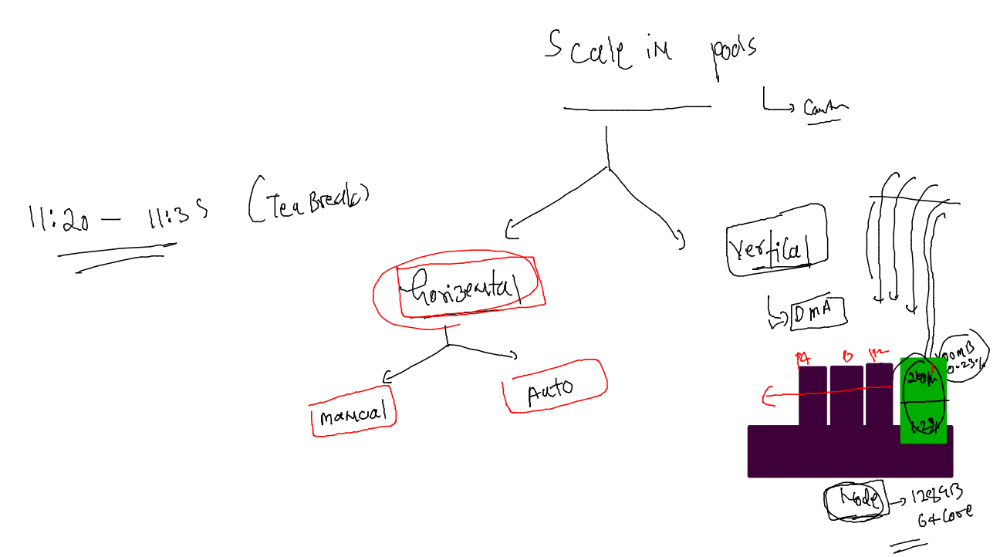
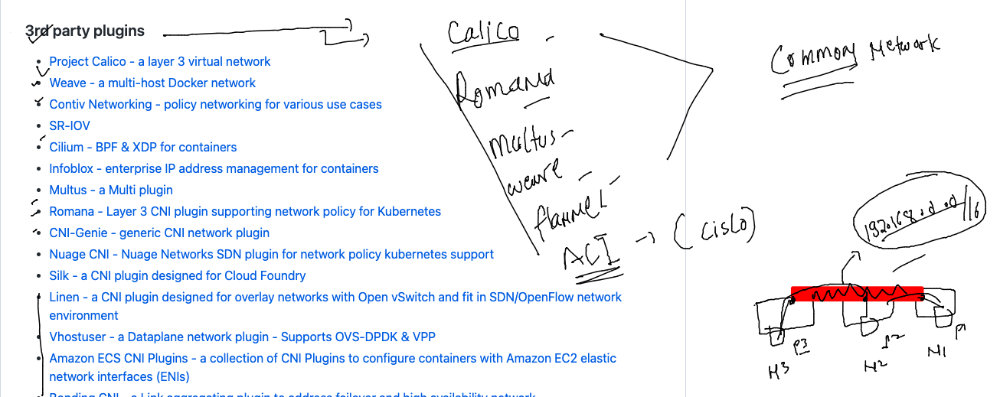
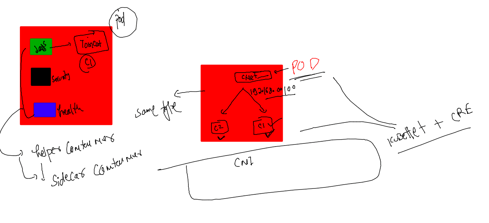

### getting started with Namespaces in K8s 


### listing namespaces 

```
[ashu@ip-172-31-87-240 ashu-apps]$ kubectl  get  namespaces 
NAME              STATUS   AGE
default           Active   20h
kube-node-lease   Active   20h
kube-public       Active   20h
kube-system       Active   20h
[ashu@ip-172-31-87-240 ashu-apps]$ kubectl   get  pods
No resources found in default namespace.
[ashu@ip-172-31-87-240 ashu-apps]$ 
[ashu@ip-172-31-87-240 ashu-apps]$ whoami
ashu
[ashu@ip-172-31-87-240 ashu-apps]$
```
### creating ns and set as default 

```
[ashu@ip-172-31-87-240 k8s-resources]$ kubectl  create  namespace  ashu-project --dry-run=client -o yaml 
apiVersion: v1
kind: Namespace
metadata:
  creationTimestamp: null
  name: ashu-project
spec: {}
status: {}
[ashu@ip-172-31-87-240 k8s-resources]$ kubectl  create  namespace  ashu-project 
namespace/ashu-project created
[ashu@ip-172-31-87-240 k8s-resources]$ kubectl  get  ns
NAME              STATUS   AGE
ashu-project      Active   4s
default           Active   20h
kube-node-lease   Active   20h
kube-public       Active   20h
kube-system       Active   20h
[ashu@ip-172-31-87-240 k8s-resources]$ kubectl  config set-context --current --namespace=ashu-project 
Context "kubernetes-admin@kubernetes" modified.
[ashu@ip-172-31-87-240 k8s-resources]$ kubectl  get  pods
No resources found in ashu-project namespace.
[ashu@ip-172-31-87-240 k8s-resources]$ 
[ashu@ip-172-31-87-240 k8s-resources]$ 
```

### checking default ns 

```
[ashu@ip-172-31-87-240 k8s-resources]$ kubectl  config  get-contexts 
CURRENT   NAME                          CLUSTER      AUTHINFO           NAMESPACE
*         kubernetes-admin@kubernetes   kubernetes   kubernetes-admin   ashu-project
[ashu@ip-172-31-87-240 k8s-resources]$ 
```

### doing the same in personal namespace 

```
[ashu@ip-172-31-87-240 k8s-resources]$ ls
ashupod1.yaml  autopod.json  autopod.yaml  mysecret.yaml  ocrpod.yaml
[ashu@ip-172-31-87-240 k8s-resources]$ 
[ashu@ip-172-31-87-240 k8s-resources]$ 
[ashu@ip-172-31-87-240 k8s-resources]$ kubectl apply -f mysecret.yaml  -f  ocrpod.yaml 
secret/ashu-reg-secret created
pod/ashunewpod created
[ashu@ip-172-31-87-240 k8s-resources]$ kubectl  get  secret 
NAME                  TYPE                                  DATA   AGE
ashu-reg-secret       kubernetes.io/dockerconfigjson        1      10s
default-token-xnpnd   kubernetes.io/service-account-token   3      4m18s
[ashu@ip-172-31-87-240 k8s-resources]$ kubectl  get  po
NAME         READY   STATUS    RESTARTS   AGE
ashunewpod   1/1     Running   0          14s
[ashu@ip-172-31-87-240 k8s-resources]$ kubectl delete -f mysecret.yaml  -f ocrpod.yaml 
secret "ashu-reg-secret" deleted
pod "ashunewpod" deleted
[ashu@ip-172-31-87-240 k8s-resources]$ 
```

## Introduction to k8s controllers 


### stateless vs statefull apps in k8s 


### creating deployment yaml 

```
kubectl  create  deployment  ashu-deploy1  --image=docker.io/dockerashu/oraclejava:webappv1  --port  8080 --dry-run=client -o yaml >mydeploy.yaml
```

### YAML 

```
apiVersion: apps/v1
kind: Deployment
metadata:
  creationTimestamp: null
  labels:
    app: ashu-deploy1
  name: ashu-deploy1 # name of deployment 
spec:
  replicas: 1 # number of pod we want 
  selector:
    matchLabels:
      app: ashu-deploy1
  strategy: {}
  template: # to create pods deployment will be using template of pod
    metadata:
      creationTimestamp: null
      labels:
        app: ashu-deploy1
    spec:
      containers:
      - image: docker.io/dockerashu/oraclejava:webappv1
        name: oraclejava
        ports:
        - containerPort: 8080
        resources: {}
status: {}

```

### deploy it 

```
[ashu@ip-172-31-87-240 k8s-resources]$ kubectl apply -f mydeploy.yaml 
deployment.apps/ashu-deploy1 created
[ashu@ip-172-31-87-240 k8s-resources]$ 
[ashu@ip-172-31-87-240 k8s-resources]$ kubectl  get  deployment 
NAME           READY   UP-TO-DATE   AVAILABLE   AGE
ashu-deploy1   1/1     1            1           6s
[ashu@ip-172-31-87-240 k8s-resources]$ kubectl  get pods
NAME                           READY   STATUS    RESTARTS   AGE
ashu-deploy1-7d7d754b6-9lhfw   1/1     Running   0          17s
[ashu@ip-172-31-87-240 k8s-resources]$ kubectl delete pod ashu-deploy1-7d7d754b6-9lhfw
pod "ashu-deploy1-7d7d754b6-9lhfw" deleted
[ashu@ip-172-31-87-240 k8s-resources]$ kubectl  get pods
NAME                           READY   STATUS    RESTARTS   AGE
ashu-deploy1-7d7d754b6-wvkbq   1/1     Running   0          4s
[ashu@ip-172-31-87-240 k8s-resources]$ 
```

### using secret in deployment file 

```
apiVersion: apps/v1
kind: Deployment
metadata:
  creationTimestamp: null
  labels:
    app: ashu-deploy1
  name: ashu-deploy1
spec:
  replicas: 1
  selector:
    matchLabels:
      app: ashu-deploy1
  strategy: {}
  template: # this is of pod 
    metadata:
      creationTimestamp: null
      labels:
        app: ashu-deploy1
    spec:
      imagePullSecrets:
      - name: ashu-reg-secret
      containers:
      - image: phx.ocir.io/ax8yv0ztaclr/newapp:v1
        name: newapp
        ports:
        - containerPort: 8080
        resources: {}
status: {}

```

### Scaling of POds 



### manul scaling of pod 

```
[ashu@ip-172-31-87-240 k8s-resources]$ kubectl  get  deploy 
NAME           READY   UP-TO-DATE   AVAILABLE   AGE
ashu-deploy1   1/1     1            1           69s
[ashu@ip-172-31-87-240 k8s-resources]$ kubectl scale  deployment  ashu-deploy1 --replicas=3
deployment.apps/ashu-deploy1 scaled
[ashu@ip-172-31-87-240 k8s-resources]$ kubectl  get  po -owide
NAME                           READY   STATUS    RESTARTS   AGE   IP                NODE      NOMINATED NODE   READINESS GATES
ashu-deploy1-7d7d754b6-9jzn8   1/1     Running   0          9s    192.168.179.234   minion2   <none>           <none>
ashu-deploy1-7d7d754b6-q4ghr   1/1     Running   0          91s   192.168.179.233   minion2   <none>           <none>
ashu-deploy1-7d7d754b6-vbwsc   1/1     Running   0          9s    192.168.34.55     minion1   <none>           <none>
[ashu@ip-172-31-87-240 k8s-resources]$ 
```
### some info about CNI 



### sidecar container concept 



### creating a pod 

```
apiVersion: v1
kind: Pod
metadata:
  creationTimestamp: null
  labels:
    run: ashu-net1
  name: ashu-net1
spec:
  containers:
  - image: alpine
    name: ashu-net1
    command: ['sleep','1000']
    resources: {}
  dnsPolicy: ClusterFirst
  restartPolicy: Always
status: {}

```
====
```
[ashu@ip-172-31-87-240 k8s-resources]$ kubectl replace -f nettest1.yaml --force
pod "ashu-net1" deleted
pod/ashu-net1 replaced
[ashu@ip-172-31-87-240 k8s-resources]$ kubectl  get po 
NAME        READY   STATUS    RESTARTS   AGE
ashu-net1   1/1     Running   0          4s
[ashu@ip-172-31-87-240 k8s-resources]$ kubectl  get  po -owide
NAME        READY   STATUS    RESTARTS   AGE   IP              NODE      NOMINATED NODE   READINESS GATES
ashu-net1   1/1     Running   0          44s   192.168.34.63   minion1   <none>           <none>
[ashu@ip-172-31-87-240 k8s-resources]$ 

```

### checking ip 

```
ashu-net1   1/1     Running   0          4s
[ashu@ip-172-31-87-240 k8s-resources]$ kubectl  get  po -owide
NAME        READY   STATUS    RESTARTS   AGE   IP              NODE      NOMINATED NODE   READINESS GATES
ashu-net1   1/1     Running   0          44s   192.168.34.63   minion1   <none>           <none>
[ashu@ip-172-31-87-240 k8s-resources]$ kubectl  describe pod ashu-net1
Name:             ashu-net1
Namespace:        ashu-project
Priority:         0
Service Account:  default
Node:             minion1/10.0.0.21
Start Time:       Thu, 05 Jan 2023 06:43:58 +0000
Labels:           run=ashu-net1
Annotations:      cni.projectcalico.org/containerID: 5fe4f0652da68fae766f431c7243598cbc2548481e55f9dabe73b178b290f620
                  cni.projectcalico.org/podIP: 192.168.34.63/32
                  cni.projectcalico.org/podIPs: 192.168.34.63/32
Status:           Running
IP:               192.168.34.63
```


### checking container ip 

```
[ashu@ip-172-31-87-240 k8s-resources]$ kubectl  get po 
NAME        READY   STATUS    RESTARTS   AGE
ashu-net1   1/1     Running   0          2m4s
[ashu@ip-172-31-87-240 k8s-resources]$ kubectl  get po  -o wide
NAME        READY   STATUS    RESTARTS   AGE    IP              NODE      NOMINATED NODE   READINESS GATES
ashu-net1   1/1     Running   0          2m8s   192.168.34.63   minion1   <none>           <none>
[ashu@ip-172-31-87-240 k8s-resources]$ 
[ashu@ip-172-31-87-240 k8s-resources]$ kubectl  exec -it ashu-net1  -- sh 
/ # ifconfig 
eth0      Link encap:Ethernet  HWaddr DA:B3:E6:10:2A:3C  
          inet addr:192.168.34.63  Bcast:0.0.0.0  Mask:255.255.255.255
          UP BROADCAST RUNNING MULTICAST  MTU:8980  Metric:1
          RX packets:5 errors:0 dropped:0 overruns:0 frame:0
          TX packets:0 errors:0 dropped:0 overruns:0 carrier:0
          collisions:0 txqueuelen:0 
          RX bytes:446 (446.0 B)  TX bytes:0 (0.0 B)

```


