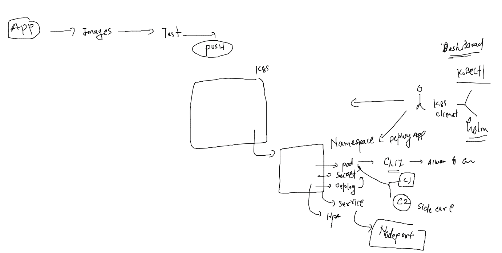
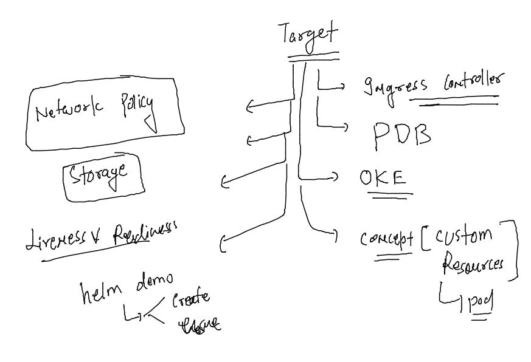
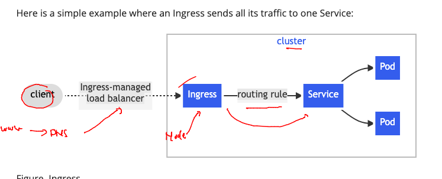
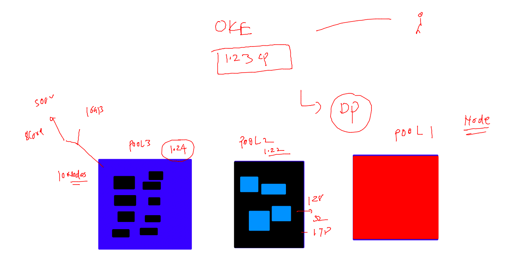

### getting started 

### Revision 



### target for the day 



### to add new node in running cluster 

### do all the pre-requiste in new machine 

```
  1  vim /etc/fstab 
    2  swapoff  -a
    3  free -m
    4  setenforce  0
    5  sed -i 's/SELINUX=enforcing/SELINUX=disabled/'  /etc/selinux/config
    6  modprobe br_netfilter
    7  echo '1' > /proc/sys/net/bridge/bridge-nf-call-iptables
    8  yum install docker -y
    9  mkdir  /etc/docker
   10  cat  <<X  >/etc/docker/daemon.json
{
  "exec-opts": ["native.cgroupdriver=systemd"]
}

X

   11  systemctl enable --now docker 
   12  history 
   13  cat  <<EOF  >/etc/yum.repos.d/kube.repo
[kube]
baseurl=https://packages.cloud.google.com/yum/repos/kubernetes-el7-x86_64
gpgcheck=0
EOF

   14  yum install kubeadm-1.23* kubelet-1.23* 
   15  systemctl enable --now kubelet 
```

### print token in control plane 

```
kubeadm token create --print-join-command 
```

### output you can paste in new node 

```
 kubeadm join 10.0.0.3:6443 --toke
```

### Ingress in k8s 



## Nodepool in cloud controlled k8s -- OKE 



### demo of external LB in OKE 

```
thexyzcomp@cloudshell:ashu (us-phoenix-1)$ ls
ns.yaml
thexyzcomp@cloudshell:ashu (us-phoenix-1)$ kubectl create deployment ashu-dep1 --image=docker.io/dockerashu/webui:oraclev1 --port 80 --namespace=ashu-app --dry-run=client -o yaml >deploy.yaml
thexyzcomp@cloudshell:ashu (us-phoenix-1)$ kubectl apply -f deploy.yaml 
deployment.apps/ashu-dep1 created
thexyzcomp@cloudshell:ashu (us-phoenix-1)$ kubectl get deploy 
No resources found in default namespace.
thexyzcomp@cloudshell:ashu (us-phoenix-1)$ kubectl get deploy  -n ashu-app
NAME        READY   UP-TO-DATE   AVAILABLE   AGE
ashu-dep1   1/1     1            1           16s
thexyzcomp@cloudshell:ashu (us-phoenix-1)$ 

```

### creating service 

```
thexyzcomp@cloudshell:ashu (us-phoenix-1)$ kubectl  get deploy -n ashu-app
NAME        READY   UP-TO-DATE   AVAILABLE   AGE
ashu-dep1   1/1     1            1           2m21s
thexyzcomp@cloudshell:ashu (us-phoenix-1)$ 
thexyzcomp@cloudshell:ashu (us-phoenix-1)$ 
thexyzcomp@cloudshell:ashu (us-phoenix-1)$ kubectl expose deploy ashu-dep1 --type NodePort --port 80 --name ashulb1 --namespace=ashu-app --dry-run=client -o yaml >np.yaml 
thexyzcomp@cloudshell:ashu (us-phoenix-1)$ ls
deploy.yaml  np.yaml  ns.yaml
thexyzcomp@cloudshell:ashu (us-phoenix-1)$ kubectl apply -f np.yaml 
service/ashulb1 created
thexyzcomp@cloudshell:ashu (us-phoenix-1)$ kubectl get svc -n ashu-app
NAME      TYPE       CLUSTER-IP     EXTERNAL-IP   PORT(S)        AGE
ashulb1   NodePort   10.96.42.240   <none>        80:31750/TCP   8s
thexyzcomp@cloudshell:ashu (us-phoenix-1)$ 


```

### creating Lb type service 

```
thexyzcomp@cloudshell:ashu (us-phoenix-1)$ kubectl expose deploy ashu-dep1 --type LoadBalancer --port 80 --name ashulb2 --namespace=ashu-app --dry-run=client -o yaml >lb.yaml 
thexyzcomp@cloudshell:ashu (us-phoenix-1)$ kubectl apply -f lb.yaml 
service/ashulb2 created
thexyzcomp@cloudshell:ashu (us-phoenix-1)$ kubectl get svc -n ashu-app
NAME      TYPE           CLUSTER-IP      EXTERNAL-IP   PORT(S)        AGE
ashulb2   LoadBalancer   10.96.139.192   <pending>     80:32239/TCP   9s
thexyzcomp@cloudshell:ashu (us-phoenix-1)$ kubectl get svc -n ashu-app
NAME      TYPE           CLUSTER-IP      EXTERNAL-IP       PORT(S)        AGE
ashulb2   LoadBalancer   10.96.139.192   129.153.123.215   80:32239/TCP   56s
thexyzcomp@cloudshell:ashu (us-phoenix-1)$ 
```

### Nginx ingress controller deploy 

```
thexyzcomp@cloudshell:ashu (us-phoenix-1)$ kubectl apply -f https://raw.githubusercontent.com/kubernetes/ingress-nginx/main/deploy/static/provider/cloud/deploy.yaml
namespace/ingress-nginx created
serviceaccount/ingress-nginx created
serviceaccount/ingress-nginx-admission created
role.rbac.authorization.k8s.io/ingress-nginx created
role.rbac.authorization.k8s.io/ingress-nginx-admission created
clusterrole.rbac.authorization.k8s.io/ingress-nginx created
clusterrole.rbac.authorization.k8s.io/ingress-nginx-admission created
rolebinding.rbac.authorization.k8s.io/ingress-nginx created
rolebinding.rbac.authorization.k8s.io/ingress-nginx-admission created
clusterrolebinding.rbac.authorization.k8s.io/ingress-nginx created
clusterrolebinding.rbac.authorization.k8s.io/ingress-nginx-admission created
configmap/ingress-nginx-controller created
service/ingress-nginx-controller created
service/ingress-nginx-controller-admission created
deployment.apps/ingress-nginx-controller created
job.batch/ingress-nginx-admission-create created
job.batch/ingress-nginx-admission-patch created
ingressclass.networking.k8s.io/nginx created
validatingwebhookconfiguration.admissionregistration.k8s.io/ingress-nginx-admission created
thexyzcomp@cloudshell:ashu (us-phoenix-1)$ kubectl get ns
NAME              STATUS   AGE
anand-app         Active   29m
ankita-ns         Active   29m
ashu-app          Active   31m
default           Active   76m
ingress-nginx     Active   15s
kube-node-lease   Active   76m
```

### Only external Lb we need is for Ingress 

```
thexyzcomp@cloudshell:ashu (us-phoenix-1)$ kubectl  get deploy -n ingress-nginx
NAME                       READY   UP-TO-DATE   AVAILABLE   AGE
ingress-nginx-controller   1/1     1            1           94s
thexyzcomp@cloudshell:ashu (us-phoenix-1)$ kubectl  get po  -n ingress-nginx
NAME                                        READY   STATUS      RESTARTS   AGE
ingress-nginx-admission-create-q57pp        0/1     Completed   0          106s
ingress-nginx-admission-patch-jpdcr         0/1     Completed   1          106s
ingress-nginx-controller-7d5fb757db-f2ctk   1/1     Running     0          106s
thexyzcomp@cloudshell:ashu (us-phoenix-1)$ kubectl  get svc  -n ingress-nginx
NAME                                 TYPE           CLUSTER-IP     EXTERNAL-IP      PORT(S)                      AGE
ingress-nginx-controller             LoadBalancer   10.96.23.252   129.153.87.217   80:32338/TCP,443:30631/TCP   113s
ingress-nginx-controller-admission   ClusterIP      10.96.182.80   <none>           443/TCP                      113s
thexyzcomp@cloudshell:ashu (us-phoenix-1)$ 

```

### creating deployment and scale it 

```
thexyzcomp@cloudshell:ashu (us-phoenix-1)$ kubectl get deploy -n ashu-app
NAME        READY   UP-TO-DATE   AVAILABLE   AGE
ashu-dep1   1/1     1            1           32m
thexyzcomp@cloudshell:ashu (us-phoenix-1)$ 
thexyzcomp@cloudshell:ashu (us-phoenix-1)$ kubectl -n ashu-app scale deploy ashu-dep1 --replicas=3
deployment.apps/ashu-dep1 scaled
thexyzcomp@cloudshell:ashu (us-phoenix-1)$ kubectl get deploy -n ashu-app
NAME        READY   UP-TO-DATE   AVAILABLE   AGE
ashu-dep1   3/3     3            3           32m
thexyzcomp@cloudshell:ashu (us-phoenix-1)$ kubectl get po -o wide -n ashu-app
NAME                         READY   STATUS    RESTARTS   AGE   IP             NODE          NOMINATED NODE   READINESS GATES
ashu-dep1-6548d55bd7-7v45x   1/1     Running   0          16s   10.244.0.135   10.0.10.239   <none>           <none>
ashu-dep1-6548d55bd7-t6cnt   1/1     Running   0          33m   10.244.1.3     10.0.10.90    <none>           <none>
ashu-dep1-6548d55bd7-z25v5   1/1     Running   0          17s   10.244.0.7     10.0.10.46    <none>           <none>
thexyzcomp@cloudshell:ashu (us-phoenix-1)$ kubectl get no
NAME          STATUS   ROLES   AGE   VERSION
10.0.10.239   Ready    node    50m   v1.23.4
10.0.10.46    Ready    node    50m   v1.23.4
10.0.10.90    Ready    node    50m   v1.23.4
thexyzcomp@cloudshell:ashu (us-phoenix-1)$ 
```

### creating clusterIP service 

```
thexyzcomp@cloudshell:ashu (us-phoenix-1)$ kubectl get deploy -n ashu-app
NAME        READY   UP-TO-DATE   AVAILABLE   AGE
ashu-dep1   3/3     3            3           34m
thexyzcomp@cloudshell:ashu (us-phoenix-1)$ kubectl expose deploy ashu-dep1 --type ClusterIP --port 80 --name ashulb007 --namespace ashu-app --dry-run=client -o yaml >clustrip.yaml 
thexyzcomp@cloudshell:ashu (us-phoenix-1)$ kubectl apply -f clustrip.yaml 
service/ashulb007 created
thexyzcomp@cloudshell:ashu (us-phoenix-1)$ kubectl get svc -n ashu-app
NAME        TYPE        CLUSTER-IP      EXTERNAL-IP   PORT(S)   AGE
ashulb007   ClusterIP   10.96.248.182   <none>        80/TCP    9s
thexyzcomp@cloudshell:ashu (us-phoenix-1)$ 
```


### creating ingress rule 

```
apiVersion: networking.k8s.io/v1
kind: Ingress
metadata:
  name: ashu-app-ingress-rule # name of ingress rule 
  namespace: ashu-app # adding namespace
  annotations:
    nginx.ingress.kubernetes.io/rewrite-target: /
spec:
  ingressClassName: nginx # change class name to nginx 
  rules:
  - host: japur.ashutoshh.in # my app domain name 
    http:
      paths:
      - path: / # home page of app 
        pathType: Prefix
        backend:
          service:
            name: ashulb007
            port:
              number: 80

```

### create it 

```
thexyzcomp@cloudshell:ashu (us-phoenix-1)$ vim  ingress-rule.yaml 
thexyzcomp@cloudshell:ashu (us-phoenix-1)$ kubectl apply -f ingress-rule.yaml  
ingress.networking.k8s.io/ashu-app-ingress-rule created
thexyzcomp@cloudshell:ashu (us-phoenix-1)$ kubectl get ingress -n ashu-app
NAME                    CLASS   HOSTS                ADDRESS   PORTS   AGE
ashu-app-ingress-rule   nginx   japur.ashutoshh.in             80      11s
thexyzcomp@cloudshell:ashu (us-phoenix-1)$ 

```
